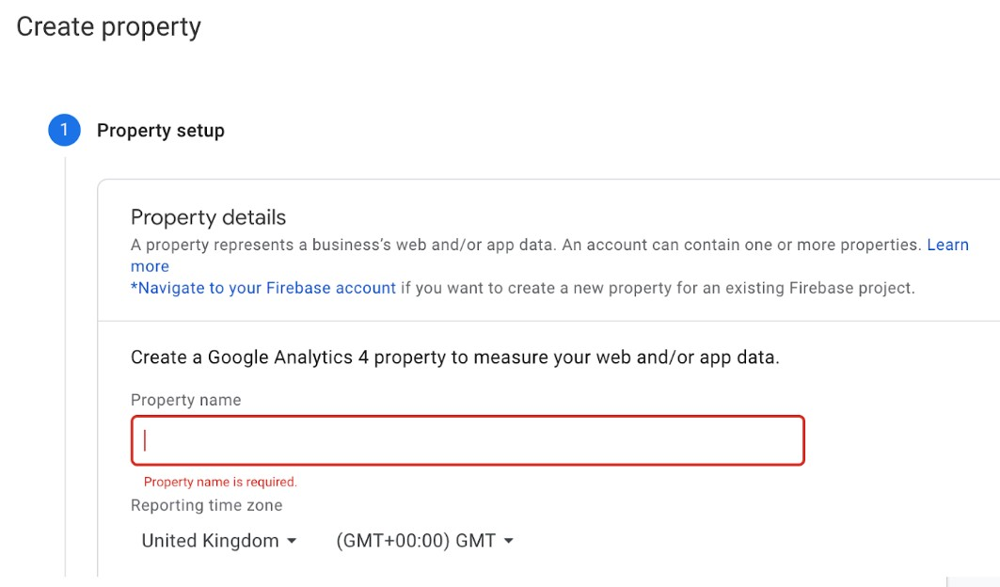
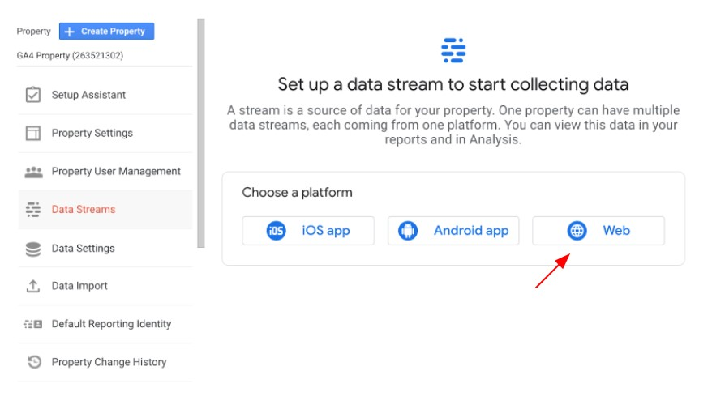
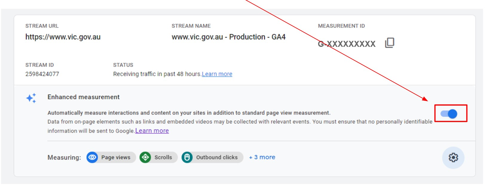
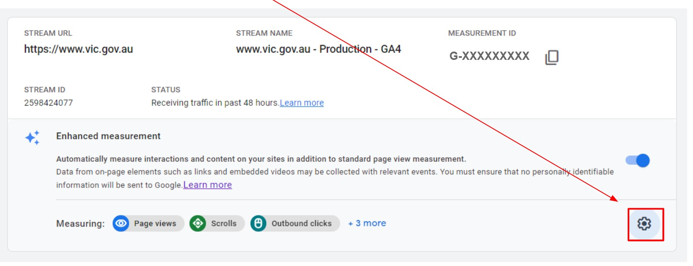
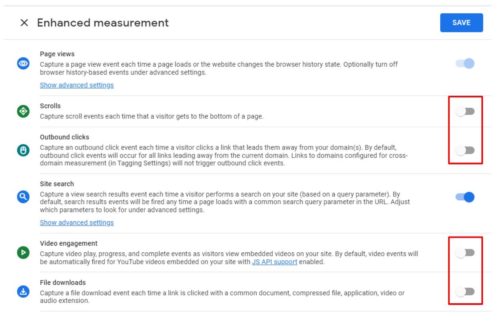
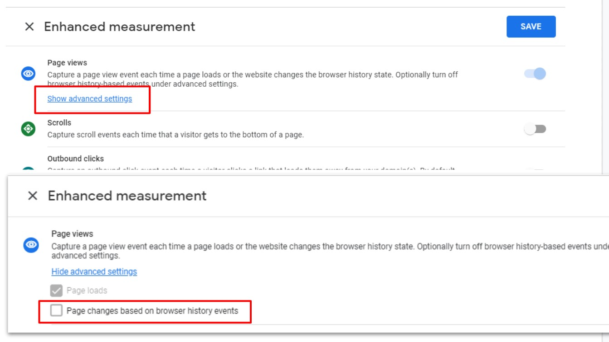
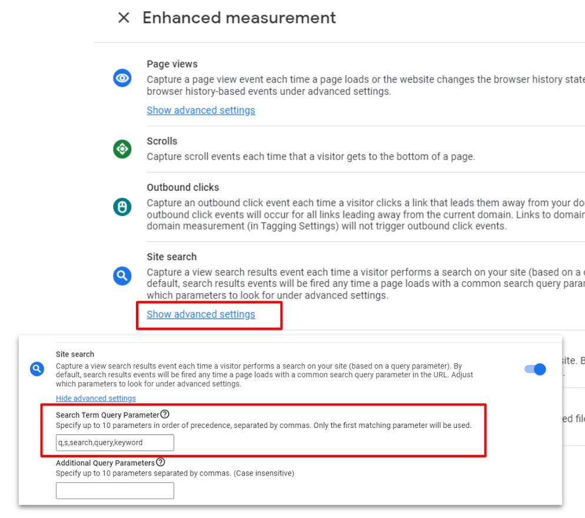
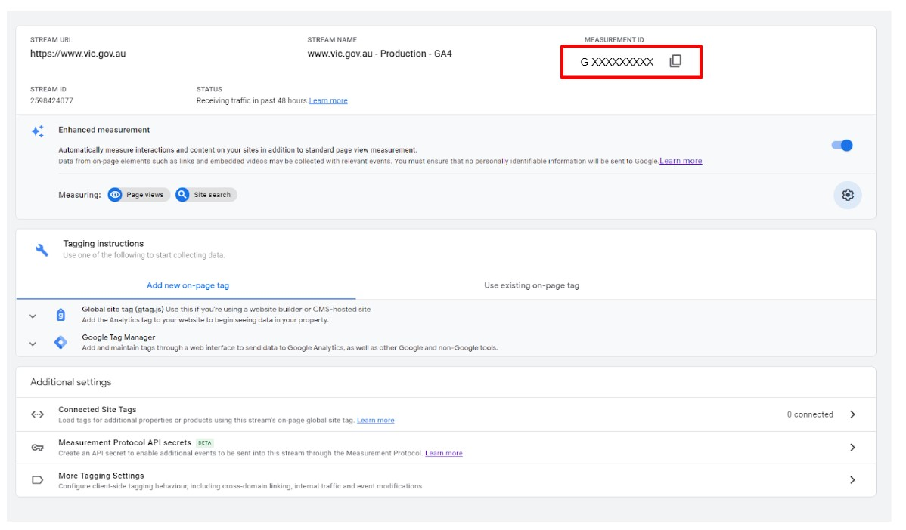
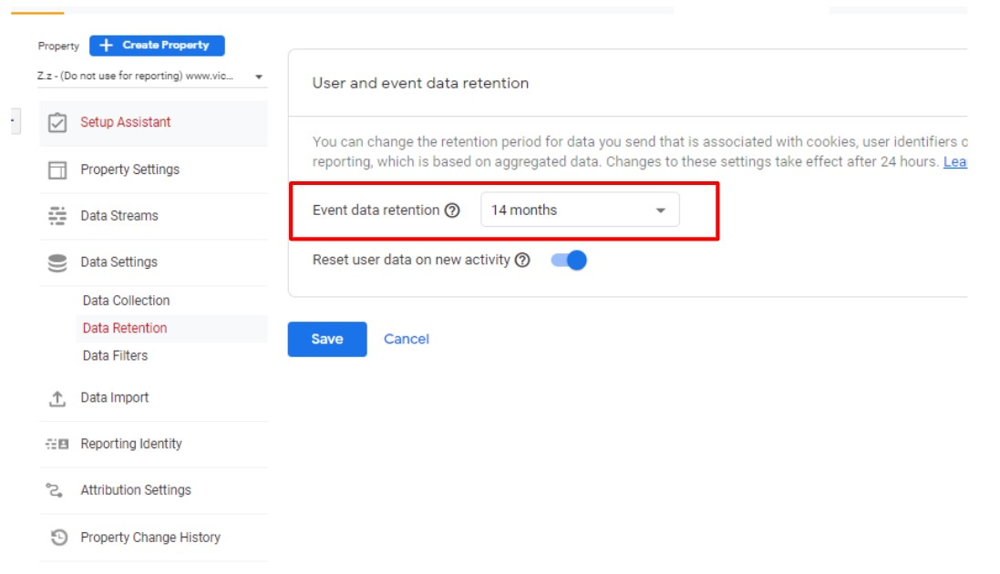

# 1.1 - Google Analytics 4

## Table of Contents
- [1.1.1 - Creating a GA4 Property](1---configure-google-analytics-4#1.1.1---creating-a-ga4-property)
- [1.1.2 - Create a Data Stream](1---configure-google-analytics-4#1.1.2---create-a-data-stream)
- [1.1.3 - Activate Enhanced Measurement](1---configure-google-analytics-4#1.1.3---activate-enhanced-measurement)
- [1.1.4 - Modify Enhanced Measurement](1---configure-google-analytics-4#1.1.4---modify-enhanced-measurement)
- [1.1.5 - Switch off all Enhanced Measurement _Except_ Site Search](1---configure-google-analytics-4#1.1.5---switch-off-all-enhanced-measurement-_except_-site-search)
- [1.1.6 - Modify Page View Settings](1---configure-google-analytics-4#1.1.6---modify-page-view-settings)
- [1.1.7 - Configure Site Search](1---configure-google-analytics-4#1.1.7---configure-site-search)
- [1.1.8 - Take note of your measurement ID](1---configure-google-analytics-4#1.1.8---take-note-of-your-measurement-id)
- [1.1.9 - Update Data Retention Settings](1---configure-google-analytics-4#1.1.9---update-data-retention-settings)

---

## 1 - Creating a GA4 Property
* Click **Admin** to open the admin page in Google Analytics
* Click the blue **+ Create Property** button

* This automatically creates a new **GA4 Property**
* Under Property setup, enter the Property name
* * Please follow the WoVG naming convention: {{website url}} - Production
E.g: www.vic.gov.au - Production
* Select the appropriate Industry category, Reporting time zone and Currency details
* Click Create

## 2 - Create a Data Stream
* Select Data Streams in the admin section
* From the options select Web data Stream for websites.
* Enter the Website URL.
* Enter the name of the stream. (Ex:- {{client}} Web Data stream)

_Note: Data stream once created cannot be edited. It can only be deleted_

## 3 - Activate Enhanced Measurement
* Switch on the Enhanced Measurement tracking

## 4 - Modify Enhanced Measurement
* Because we are setting up tracking through GTM, we will be switching off some of the Automatically measured interactions. Click on the settings button

## 5 - Switch off all Enhanced Measurement _Except_ Site Search
* Toggle all of the enhanced measurement tracking options to **OFF** except for Site Search

## 6 - Modify Page View Settings
* Click Show Advanced Settings under Page Views
* Uncheck the box next to Page Changes based on browser history events
* Click Save

## 7 - Configure Site Search
* Click on **Show Advanced Settings** under site search
* Enter in your site search query parameter if this is different from the auto configured parameters
* Click Save

_Note: Your site search query parameter is found in the URL after you complete a site search. In the example below, this is the ‘q”._

If this is missing or you are unsure of this setting, please contact **analytics.team@dpc.vic.gov.au**

## 8 - Take note of your measurement ID
* This section is where you will find your Measurement ID
* This is what you need for completing the implementation of the WoVG Base Container

## 9 - Update Data Retention Settings
* Go back to the property settings section
* Click on Data Settings > Data Retention
* Change Event Data Retention to 14 Months
* Click Save

