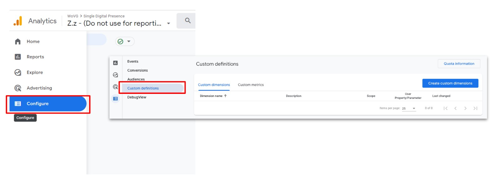
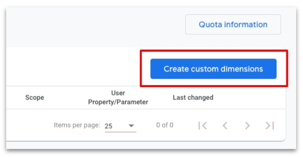
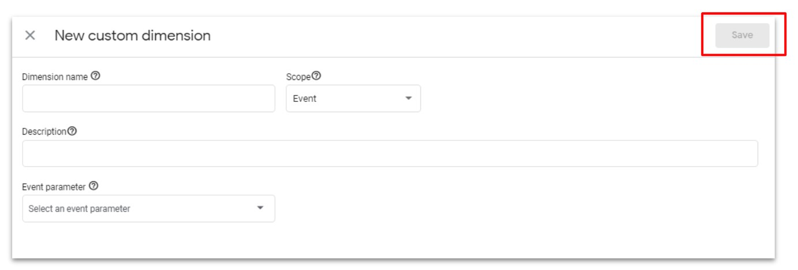

# 1.2 - Additional Information

## Table of Contents
- [1.2.1 - Custom Dimensions / Metrics Setup](1.2---additional-information#1.2.1---custom-dimensions-/-metrics-setup)
  - [1.2.1.1 - Go to Custom Definitions page](1.2---additional-information#1.2.1.1---go-to-custom-definitions-page)
  - [1.2.1.2 - Create New Custom Dimension](1.2---additional-information#1.2.1.2---create-new-custom-dimension)
  - [1.2.1.3 - Custom Dimension / Metric Mapping](1.2---additional-information#1.2.1.3---custom-dimension-/-metric-mapping)

---

## Additional Information
If you need to configure a testing GA4 property, follow the same settings with the property name {{website url}} - GA4 - Test. Use this Measurement ID in GTM to send testing traffic to a testing property

There are no “Views” in GA4. If you require views or a way to see data split out by hostname, please contact analytics.team@dpc.vic.gov.au for options

## Custom Dimensions / Metrics Setup
## 1 - Go to Custom Definitions page
* Click Configure in the main left hand side GA4 navigation
* Then enter the Custom Definitions page

## 2 - Create New Custom Dimension
* Click Create Custom Dimensions

* Use the tables below to configure the custom dimensions and custom metrics
* Click Save

## Custom Dimension / Metric Mapping
| Name                     | Description                             | Scope | User Property/Parameter  |
|--------------------------|-----------------------------------------|:-----:|--------------------------|
| AUTO Event Timestamp     | This may not show up in GA4, only in BQ | Event | event_timestamp          |
| AUTO GA Session ID       |                                         | Event | ga_session_id            |
| AUTO User Pseudo ID      | This may not show up in GA4, only in BQ |  User | user_pseudo_id           |
| Content avg read time    |                                         | Event | content_avg_read_time    |
| Content publication name |                                         | Event | content_publication_name |
| Content site section     |                                         | Event | content_site_section     |
| Content type             |                                         | Event | content_type             |
| Content word count range |                                         | Event | content_wordcount_range  |
| Department               |                                         | Event | department               |
| Error Message            |                                         | Event | error_message            |
| Event Data               |                                         | Event | event_data               |
| File Extension           |                                         | Event | file_extension           |
| File Name                |                                         | Event | file_name                |
| GTM container ID         |                                         | Event | gtm_container_id         |
| GTM container version    |                                         | Event | gtm_container_version    |
| Link Classes             |                                         | Event | link_classes             |
| Link Text                |                                         | Event | link_text                |
| Link URL                 |                                         | Event | link_url                 |
| Page Location            |                                         | Event | page_location            |
| URL Query                |                                         | Event | url_query                |
| Video Title              |                                         | Event | video_title              |
| Video URL                |                                         | Event | video_url                |

| Custom Metric Name | Description           | Scope | User Property/Parameter | Unit of Measurement |
|--------------------|-----------------------|-------|-------------------------|---------------------|
| Content word count | Metric for word count | Event | content_word_count      | Standard            |
| Video Current Time | In seconds            | Event | video_current_time      | Standard            |
| Video Duration     | In seconds            | Event | video_duration          | Standard            |
| Video Percent      | % between 1 and 100   | Event | video_percent           | Standard            |
