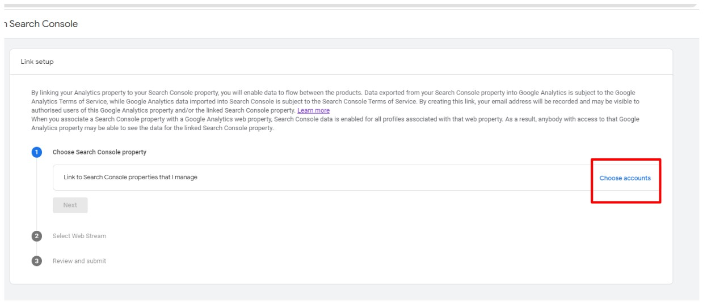
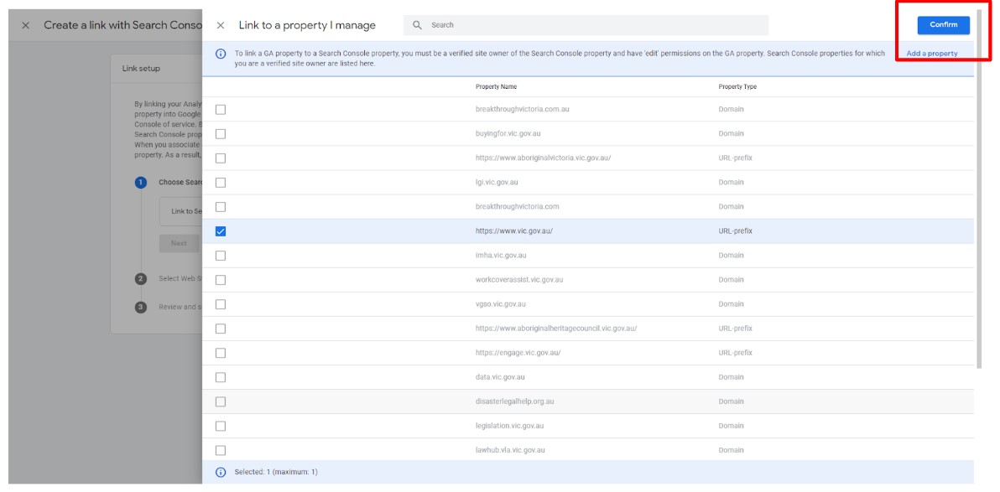
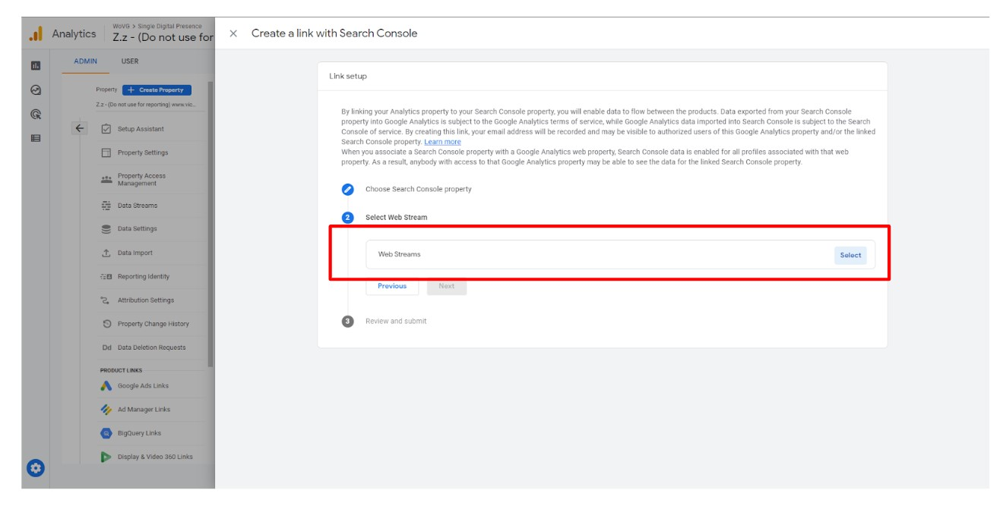
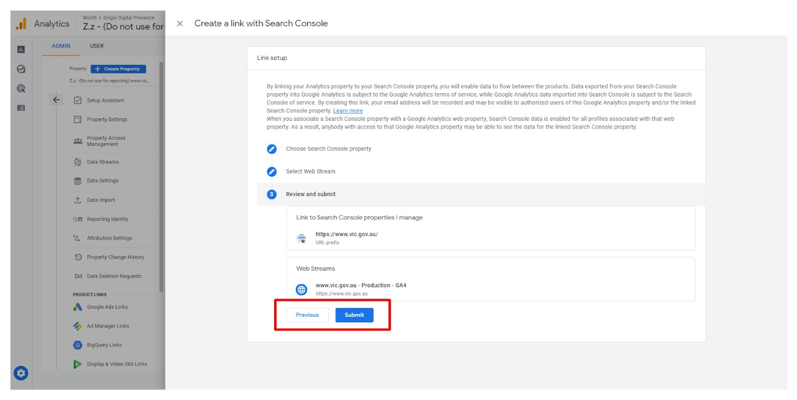

# 1.3 - Connecting Search Console
Below are the steps to follow for linking Google Search Console:
_Note: You need to be a verified owner of your websites Search Console to connect this. If you are not the verified owner and require assistance, please contact analytics.team@dpc.vic.gov.au_

* Click on Search Console Links
* Select Link then select Choose Accounts

* Select the website you want to connect. Note: You need to be a verified owner to connect the Search Console
* Select Confirm and Next

* Select web stream and select the new web stream you have just created

* Select Next, then Submit

