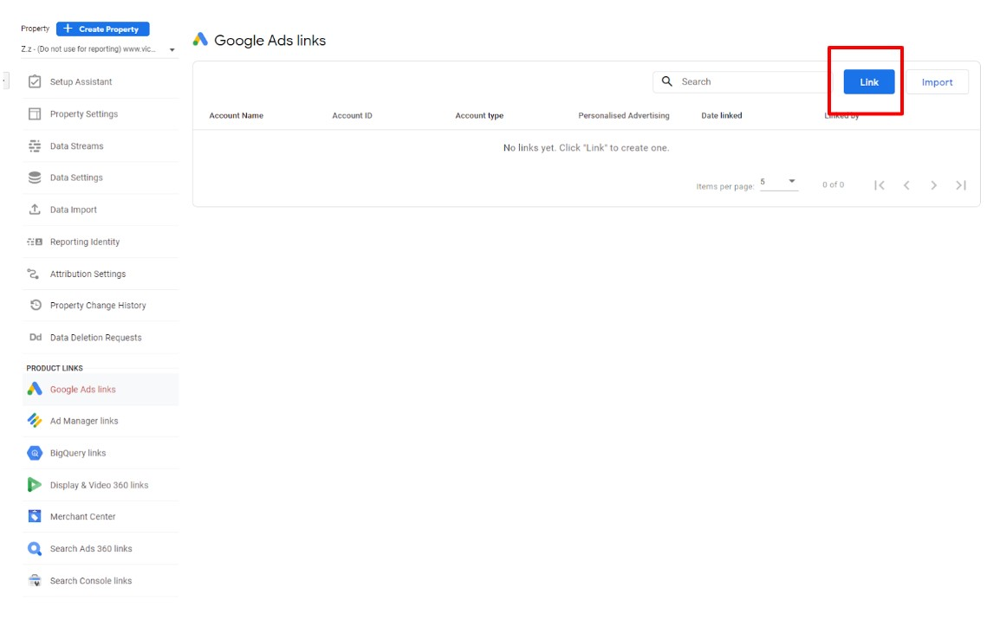

# 1.4 - Connecting Google Ads and BigQuery
## 1.4.1 - Connecting Google Ads
Below are the steps to follow for linking:
* Click on the Google Ads Linking option from the GA4 property options
* Select the desired account
* Enable Personalised Advertising
* Ensure that auto-tagging has been selected
* Review and submit to link the GA4 property to Google Ads

## 1.4.2 - Connecting BigQuery
* For all BigQuery connections, please contact analytics.team@dpc.vic.gov.au  to set this up. They have a Google Cloud Platform setup for the Victorian Government
