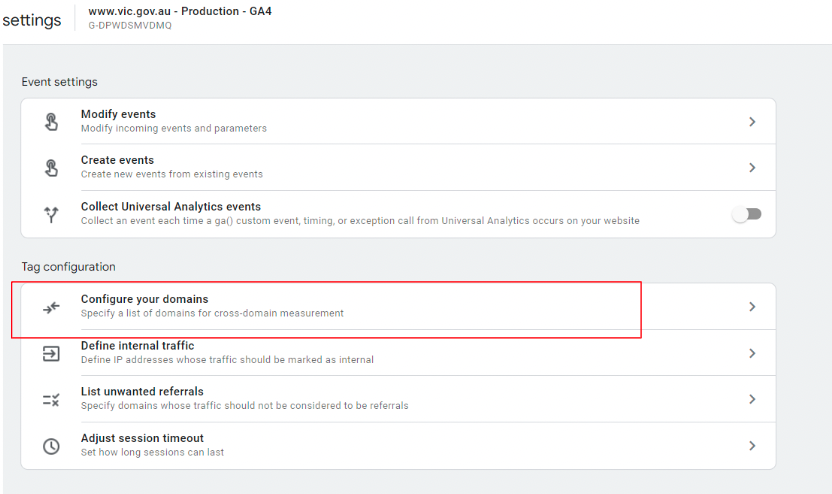
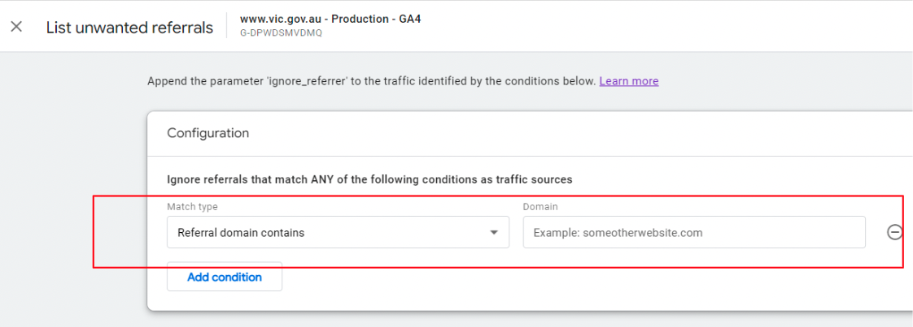

## 1.5 - Cross Domain and Referral Traffic

## Table of Contents
- [1.5.1 - Automatic self-referral detection](1.5---cross-domain-and-referral-traffic#1.5.1---automatic-self-referral-detection)
  - [1.5.1.1 - Step 1 - Configuring your domains for cross-domain measurement](1.5---cross-domain-and-referral-traffic#1.5.1.1---step-1---configuring-your-domains-for-cross-domain-measurement)
  - [1.5.1.2 - Step 2 - Configuring your domains for cross-domain measurement](1.5---cross-domain-and-referral-traffic#1.5.1.2---step-2---configuring-your-domains-for-cross-domain-measurement)
- [1.5.2 Removing unwanted referral traffic](1.5---cross-domain-and-referral-traffic#1.5.2-removing-unwanted-referral-traffic)
  - [1.5.2.1 Step 1 - Listing unwanted referrals](1.5---cross-domain-and-referral-traffic#1.5.2.1-step-1---listing-unwanted-referrals)
  - [1.5.2.2 Step 2 - Listing unwanted referrals](1.5---cross-domain-and-referral-traffic#1.5.2.2-step-2---listing-unwanted-referrals)

---

## 1.5.1 - Automatic self-referral detection
A self-referral is referral traffic that can originate from pages within your own domains. By default, Analytics will not identify traffic as referral, when:
* The referring website matched the **same domain** of the current page or any of its subdomains (e.g. your own website).
* The referring website is a result of a cross-domain measurement setup, e.g. when a user navigates across domains that you have configured in your **domains list** and the current page contains the linker parameter _gl.

## 1.5.1.1 - Step 1 - Configuring your domains for cross-domain measurement
* In Admin, navigate to one of the properties you want to include in cross-domain measurement
* In the Property column, click **Data Streams > Web**
* Click the data stream for your website, then under Additional Settings, click **More tagging settings**
* Click **Configure your domains**

## 1.5.1.2 - Step 2 - Configuring your domains for cross-domain measurement
* Under Include domains that match ANY of the following conditions:
  * Choose a match type.
  * Under Domain, enter the identifier for the domain you want to match (e.g., example.com).
* Click Add condition to add the next domain. (Add each domain you want to include in cross-domain measurement).
* Conditions are evaluated using OR logic.
* Click **Save**

_Note: Check the Analytics tag (e.g. the global site tag on each of your HTML pages) for each domain that you want to include in your cross-domain measurement.  The tag on each page must use the same Measurement ID (i.e same. "G-" ID) from the same web data stream._

## 1.5.2 - Adding unwanted referral traffic
A self-referral is referral traffic that can originate from pages within your own domains. By default, Analytics will not identify traffic as referral when the **referring website matched the same domain of the current page or any of it’s subdomains.**

## 1.5.2.1 - Step 1 - Listing unwanted referrals
* In Admin, navigate to one of the properties you want to update the referral list on
  * In the Property column, click **Data Streams > Web**
  * Click the data stream for your website, then under Additional Settings, click **More tagging settings**
* Click **List Unwanted Referrals**

## 1.5.2.2 - Step 2 - Listing unwanted referrals
* Under **Include referrals** that match ANY of the following conditions:
  * Choose a match type
  * Under Domain, enter the identifier for the domain you want to match (e.g. example.com)
  * Click Add condition to add another domain
* Conditions are evaluated using OR logic
* Click **Save**

If you have any issues with the Setup and implementation for GA4, please email analytics.team@dpc.vic.gov.au
