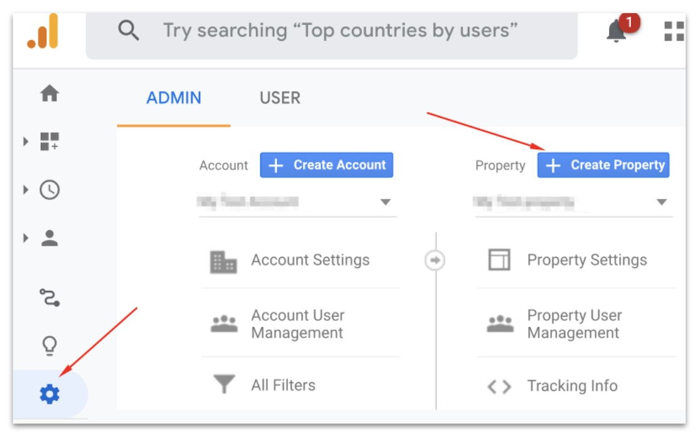
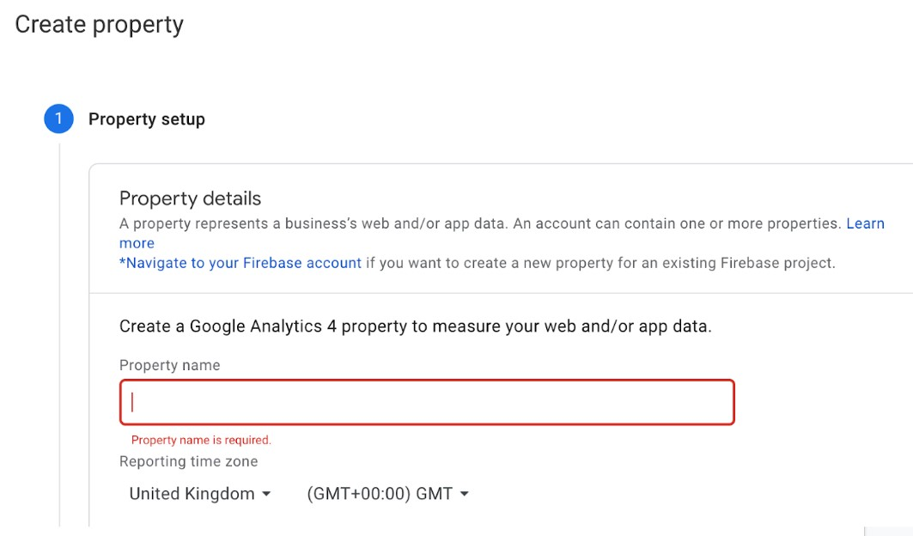
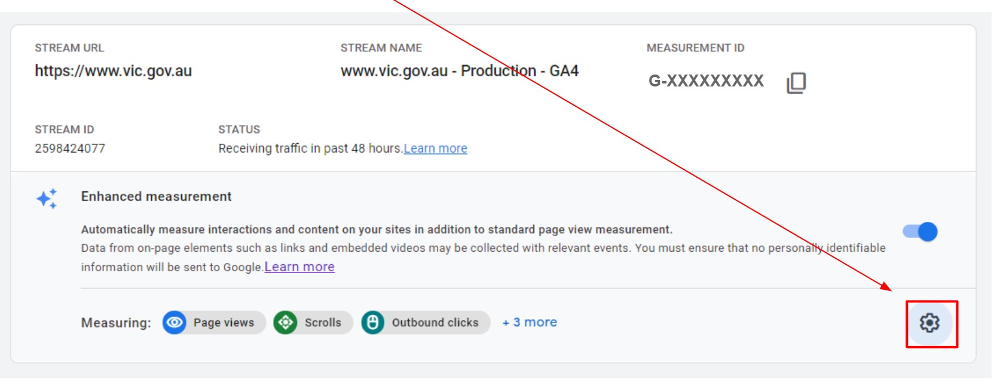
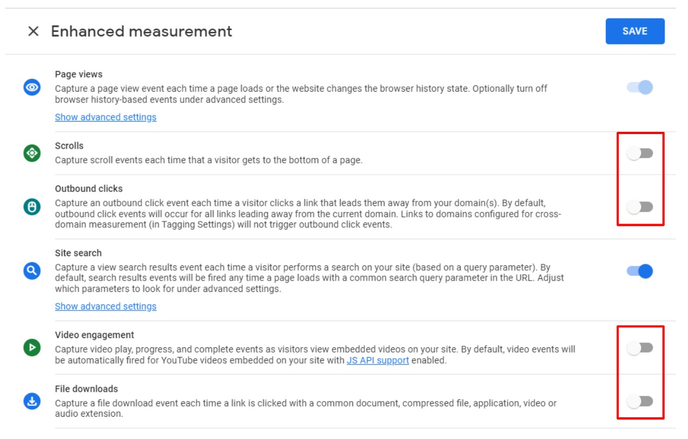
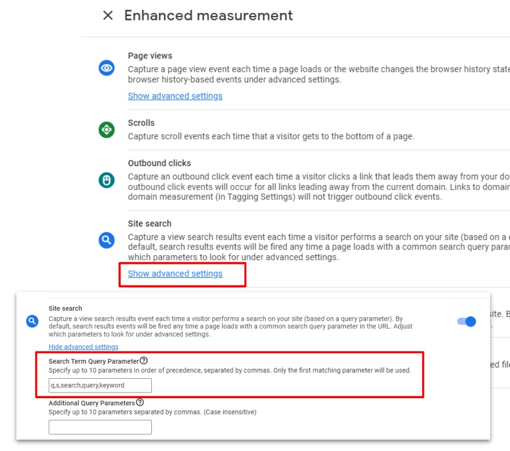
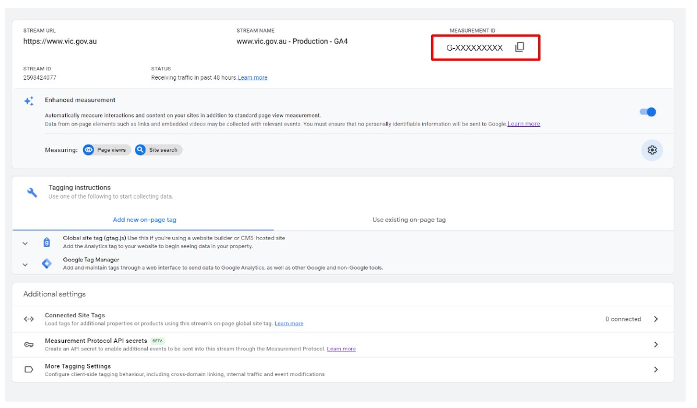
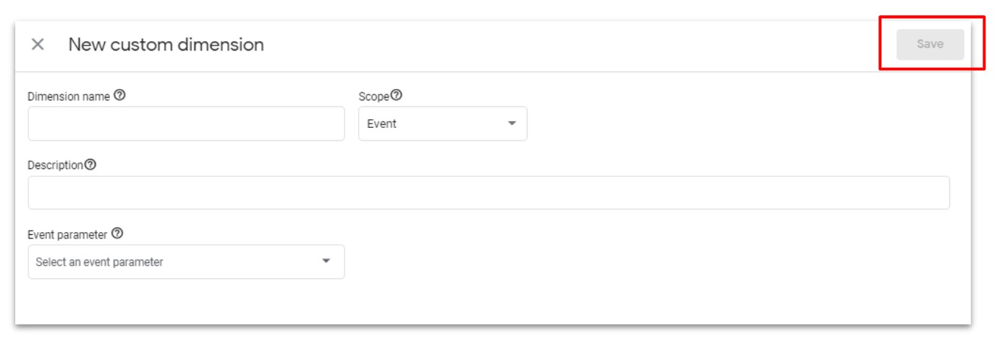
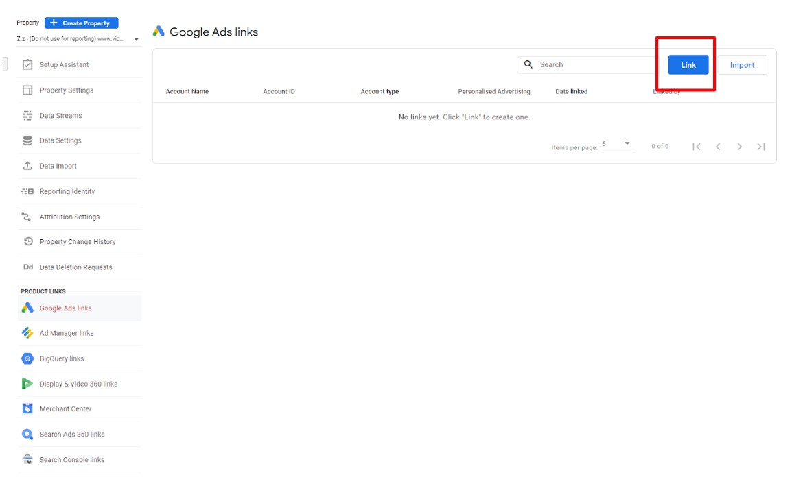
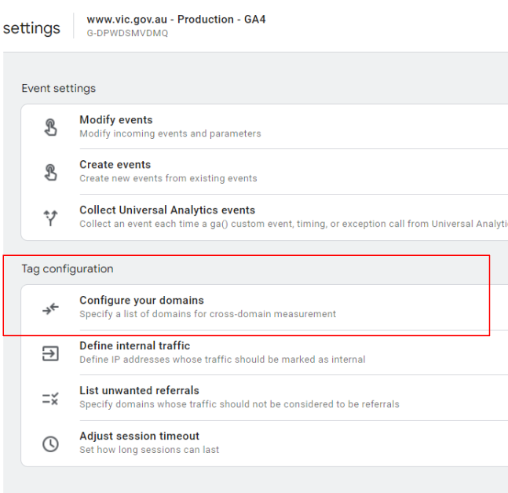

# Set up and report performance measurement for the WoVG with Google Analytics
Use these instructions to comply with the standard for the Victorian government for adding the Google Analytics tracking code to your website.

This process is **NOT** for Single Digital Presence sites.

# Google Analytics 4

### 1 - Creating a GA4 Property
* Click **Admin** to open the admin page in Google Analytics
* Click the blue **+ Create Property** button

* This automatically creates a new **GA4 Property**
* Under Property setup, enter the Property name
* * Please follow the WoVG naming convention: {{website url}} - Production
E.g: www.vic.gov.au - Production
* Select the appropriate Industry category, Reporting time zone and Currency details
* Click Create

### 2 - Create a Data Stream
* Select Data Streams in the admin section
* From the options select Web data Stream for websites.
* Enter the Website URL.
* Enter the name of the stream. (Ex:- {{client}} Web Data stream) 

_Note: Data stream once created cannot be edited. It can only be deleted_

### 3 - Activate Enhanced Measurement
* Switch on the Enhanced Measurement tracking

### 4 - Modify Enhanced Measurement
* Because we are setting up tracking through GTM, we will be switching off some of the Automatically measured interactions. Click on the settings button

### 5 - Switch off all Enhanced Measurement _Except_ Site Search
* Toggle all of the enhanced measurement tracking options to **OFF** except for Site Search

### 6 - Modify Page View Settings
* Click Show Advanced Settings under Page Views
* Uncheck the box next to Page Changes based on browser history events
* Click Save

### 7 - Configure Site Search
* Click on **Show Advanced Settings** under site search
* Enter in your site search query parameter if this is different from the auto configured parameters
* Click Save

_Note: Your site search query parameter is found in the URL after you complete a site search. In the example below, this is the ‘q”._

If this is missing or you are unsure of this setting, please contact **analytics.team@dpc.vic.gov.au**

### 8 - Take note of your measurement ID
* This section is where you will find your Measurement ID
* This is what you need for completing the implementation of the WoVG Base Container

### 9 - Update Data Retention Settings
* Go back to the property settings section
* Click on Data Settings > Data Retention
* Change Event Data Retention to 14 Months
* Click Save

### Additional Information
If you need to configure a testing GA4 property, follow the same settings with the property name {{website url}} - Test. Use this Measurement ID in GTM to send testing traffic to a testing property

There are no “Views” in GA4. If you require views or a way to see data split out by hostname, please contact analytics.team@dpc.vic.gov.au for options

## Custom Dimensions / Metrics Setup
### 1 - Go to Custom Definitions page
* Click Configure in the main left hand side GA4 navigation
* Then enter the Custom Definitions page

### 2 - Create New Custom Dimension
* Click Create Custom Dimensions 

* Use the tables below to configure the custom dimensions and custom metrics
* Click Save

### Custom Dimension / Metric Mapping
| Name                     | Description                             | Scope | User Property/Parameter  |
|--------------------------|-----------------------------------------|:-----:|--------------------------|
| AUTO Event Timestamp     | This may not show up in GA4, only in BQ | Event | event_timestamp          |
| AUTO GA Session ID       |                                         | Event | ga_session_id            |
| AUTO User Pseudo ID      | This may not show up in GA4, only in BQ |  User | user_pseudo_id           |
| Content avg read time    |                                         | Event | content_avg_read_time    |
| Content publication name |                                         | Event | content_publication_name |
| Content site section     |                                         | Event | content_site_section     |
| Content type             |                                         | Event | content_type             |
| Content word count range |                                         | Event | content_wordcount_range  |
| Department               |                                         | Event | department               |
| Error Message            |                                         | Event | error_message            |
| Event Data               |                                         | Event | event_data               |
| File Extension           |                                         | Event | file_extension           |
| File Name                |                                         | Event | file_name                |
| GTM container ID         |                                         | Event | gtm_container_id         |
| GTM container version    |                                         | Event | gtm_container_version    |
| Link Classes             |                                         | Event | link_classes             |
| Link Text                |                                         | Event | link_text                |
| Link URL                 |                                         | Event | link_url                 |
| Page Location            |                                         | Event | page_location            |
| URL Query                |                                         | Event | url_query                |
| Video Title              |                                         | Event | video_title              |
| Video URL                |                                         | Event | video_url                |

| Custom Metric Name | Description           | Scope | User Property/Parameter | Unit of Measurement |
|--------------------|-----------------------|-------|-------------------------|---------------------|
| Content word count | Metric for word count | Event | content_word_count      | Standard            |
| Video Current Time | In seconds            | Event | video_current_time      | Standard            |
| Video Duration     | In seconds            | Event | video_duration          | Standard            |
| Video Percent      | % between 1 and 100   | Event | video_percent           | Standard            |

## Connecting Search Console
Below are the steps to follow for linking Google Search Console:
_Note: You need to be a verified owner of your websites Search Console to connect this. If you are not the verified owner and require assistance, please contact analytics.team@dpc.vic.gov.au_

* Click on Search Console Links
* Select Link then select Choose Accounts

* Select the website you want to connect. Note: You need to be a verified owner to connect the Search Console
* Select Confirm and Next

* Select web stream and select the new web stream you have just created

* Select Next, then Submit

## Connecting Google Ads and BigQuery
### Connecting Google Ads
Below are the steps to follow for linking:
* Click on the Google Ads Linking option from the GA4 property options
* Select the desired account
* Enable Personalised Advertising
* Ensure that auto-tagging has been selected
* Review and submit to link the GA4 property to Google Ads

### Connecting BigQuery
* For all BigQuery connections, please contact analytics.team@dpc.vic.gov.au  to set this up. They have a Google Cloud Platform setup for the Victorian Government

## Cross Domain and Referral Traffic
### Automatic self-referral detection
A self-referral is referral traffic that can originate from pages within your own domains. By default, Analytics will not identify traffic as referral, when:
* The referring website matched the **same domain** of the current page or any of its subdomains (e.g. your own website).
* The referring website is a result of a cross-domain measurement setup, e.g. when a user navigates across domains that you have configured in your **domains list** and the current page contains the linker parameter _gl.

### Step 1 - Configuring your domains for cross-domain measurement
* In Admin, navigate to one of the properties you want to include in cross-domain measurement
* In the Property column, click **Data Streams > Web**
* Click the data stream for your website, then under Additional Settings, click **More tagging settings**
* Click **Configure your domains**

### Step 2 - Configuring your domains for cross-domain measurement
* Under Include domains that match ANY of the following conditions:
  * Choose a match type.
  * Under Domain, enter the identifier for the domain you want to match (e.g., example.com).
* Click Add condition to add the next domain. (Add each domain you want to include in cross-domain measurement).
* Conditions are evaluated using OR logic.
* Click **Save**

_Note: Check the Analytics tag (e.g. the global site tag on each of your HTML pages) for each domain that you want to include in your cross-domain measurement.  The tag on each page must use the same Measurement ID (i.e same. "G-" ID) from the same web data stream._

### Adding unwanted referral traffic
A self-referral is referral traffic that can originate from pages within your own domains. By default, Analytics will not identify traffic as referral when the **referring website matched the same domain of the current page or any of it’s subdomains.**

### Step 1 - Listing unwanted referrals
* In Admin, navigate to one of the properties you want to update the referral list on
  * In the Property column, click **Data Streams > Web**
  * Click the data stream for your website, then under Additional Settings, click **More tagging settings**
* Click **List Unwanted Referrals**

### Step 2 - Listing unwanted referrals
* Under **Include referrals** that match ANY of the following conditions:
  * Choose a match type
  * Under Domain, enter the identifier for the domain you want to match (e.g. example.com)
  * Click Add condition to add another domain
* Conditions are evaluated using OR logic
* Click **Save**

If you have any issues with the Setup and implementation for GA4, please email analytics.team@dpc.vic.gov.au 

# Universal Analytics

### Configure Google Analytics
Before you start, have your Google Analytics Universal Analytics (UA-XXXXXXXX-X) number from your site’s account ready.

If you need to set up a new UA, follow [these instructions from the Google website](https://support.google.com/analytics/answer/1042508?hl=en) or log a [support ticket with the Analytics Team](https://digital-engagement.atlassian.net/servicedesk/customer/portal/11/group/16/create/69).

### Naming Convention
These are the WoVG naming convention for Google Analytics Accounts, Properties and Views.

#### Account Name:
Create any new properties under your Departmental Account. 
* Department of Education and Training
* Department of Environment, Land, Water and Planning 
* Department of Families, Fairness and Housing
* Department of Health
* Department of Jobs, Precincts and Regions
* Department of Justice and Community Safety
* Department of Premier and Cabinet
* Department of Transport
* Department of Treasury and Finance

If your agency doesn't fall directly under one of the nine departments then or you don't know who your departmental account admin is, then log a [support ticket with the Analytics Team](https://digital-engagement.atlassian.net/servicedesk/customer/portal/11/group/16/create/69) and we will assist you.

For the Department of Premier and Cabinet, this would be:
* **Department of Premier and Cabinet**

**NOTE:** Account names are just that, names. So if your department changes its name or domain the Account Name can easily be updated to reflect that without harm to your data. The same goes for Property and View Names.

#### Property:
Properties should follow this convention, domain name - environment 

Where the domain name is that of the site you are tracking and the environment is either Production or Test.

You need two (2) Properties, one for your Live/Production site, and one for UAT/Test site
1. **dpc.vic.gov.au - Production**
2. **dpc.vic.gov.au - Test**

If you are using the [WoVG GTM Container](https://github.com/dpc-sdp/WoVG-GMP-360/tree/master/GTM360), you will need to add the required custom dimensions.
In Google Analytics, open Property >> Custom Definitions and configure your Custom Dimensions
If you aren't currently using custom dimensions you will need to pre-fill Dimension 01 to 20 with "holder.reuse (h-01)" and set to inactive.
If you can't add more than 20 custom dimensions then you haven't been upgraded to Google Analytics 360, log a [support ticket with the Analytics Team](https://digital-engagement.atlassian.net/servicedesk/customer/portal/11/group/16/create/69).

Name | Scope | State
------ | ------ | ------
holder.reuse (h-01) | HIT | Inactive
...|...
holder.reuse (h-20) | HIT | Inactive
content.site.section (h-21) | HIT | Active
content.publication.name (h-22) | HIT | Active
content.type (h-23) | HIT | Active
gtm.container.id (h-24) | HIT | Active
gtm.container.version (h-25) | HIT | Active
click.download.file.type (h-26) | HIT | Active
page.keyword (h-27) | HIT | Active
gtm.event (h-28) | HIT | Active
ga.client.id (u-29) | USER | Active
session.id (s-30) | SESSION | Active
click.classes (h-31) | HIT | Active
timestamp (h-32) | HIT | Active
content.filters (h-33) | HIT | Active
url.query (h-34) | HIT | Active
event.data (h-35) | HIT | Active
department (h-36) | HIT | Active
content.wordcount.range (h-37) | HIT | Active
content.wordcount (h-38) | HIT | Active
content.read.time (h-39) | HIT | Active

#### Views:
Your production property should have at least two (2) views

1. **Prod - Raw - dpc.vic.gov.au** In the view settings:
  * Uncheck **Bot Filtering**
  * Turn on **Site search Tracking** but don't strip the query 
2. **Prod - Filtered - dpc.vic.gov.au**

##### Recomended filters
* Lowercase Campaign Source
* Lowercase Campaign Medium
* Lowercase Campaign Name
* Lowercase Hostname
* Lowercase Request URI
* Lowercase Search Term
* Lowercase Event Category
* Lowercase Event Action
* Lowercase Event Label
* Lowercase Page Title
* Remove www from Hostname ([?](https://user-images.githubusercontent.com/32256920/116497240-37fbe200-a8ea-11eb-88d5-83258603e2be.png))

Your Test property only needs one view, though you can set up other views to test features before moving to the production view
1. **Test - Raw - dpc.vic.gov.au** Use the same settings as your **Prod - Raw** view.
