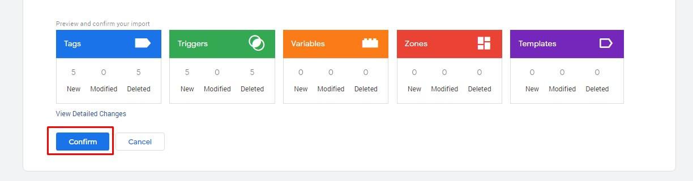

# **1 - Initial Setup/Import**

## **Set up your GA4 properties**
Ensure that there is a GA4 property set up in Google Analytics. If there is no property configured, or to ensure your existing property is set up to work with this GTM container, please refer to the [GA4 Configuration Instructions.](https://github.com/dpc-sdp/WoVG-GMP-360/blob/4aa45272ddb8b3f136685594bced2d69eb3f8181/GA360/README.md)

## **1 - Download the GTM Container Template**

Access GTM Container Template:
* Download [Template-WoVG-v3.0.json](Template-WoVG-v3.0.json)

## **2A - Import the JSON into a new container**

Access Department GTM Container:

* [https://tagmanager.google.com](https://tagmanager.google.com)
* Search for your website's GTM Container
* If a GTM Container does not exist you will need to create one under the WoVG 360 GTM Account Contact the [DPC Analytics Team](https://digital-engagement.atlassian.net/servicedesk/customer/portal/11/group/16/create/69) or your Webmaster.
* If the GTM Container already exists, and already has configurations in it, skip this section and see "2B - Import the JSON into an existing container"

Import GTM Container JSON:

* Admin > Container > Import Container
* Import Container > Select file to import > select downloaded JSON e.g. Template-WoVG-v3.0.json
* Import Container > Choose workspace > New
    * Provide a Name e.g. Import base Container
* Import Container > Choose an import option > Override
* Import Container > Preview and confirm your import > Confirm

## **2B - Import the JSON into an existing container**

**Please note importing and merging/overriding will overwrite existing configurations when they have the same name.**

If you have an existing GTM container with configurations, this process will be more involved.

You will need to merge the new import into the existing container. This can and will overwrite existing configurations if they share the same name. It is important that you select the import option "Merge" & "Override" rather than make copies. Copies may be a safer option, however you will end up with significant duplication of configurations.

This also means configurations like tracking Id’s will be replaced with placeholders, so you will need to **review the configuration folders and ensure all settings are correct after the import.**

Access Department GTM Container:

* [https://tagmanager.google.com](https://tagmanager.google.com)
* Search for your website's GTM Container
* If a GTM Container does not exist you will need to create one under the WoVG 360 GTM Account Contact the [DPC Analytics Team](https://digital-engagement.atlassian.net/servicedesk/customer/portal/11/group/16/create/69) or your Webmaster.

Import GTM Container JSON:

* Admin > Container > Import Container
* Import Container > Select file to import > select downloaded JSON e.g. Template-WoVG-v3.0.json
* Import Container > Choose workspace > New
    * Provide a Name e.g. Import Template Container
* Import Container > Choose an import option > Merge > Overwrite conflicting tags
* Import Container > Preview and confirm your import > Confirm

