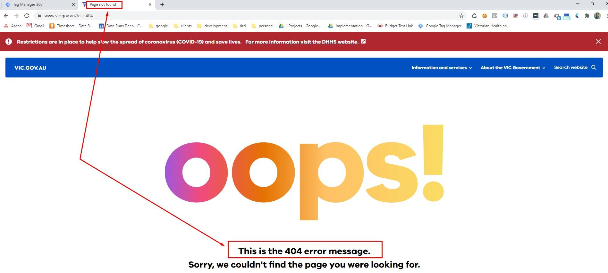
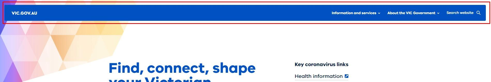
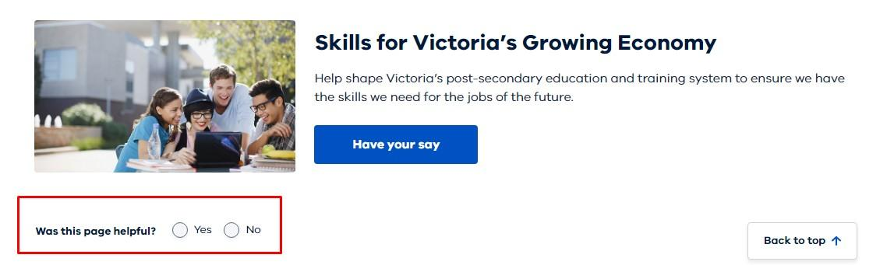
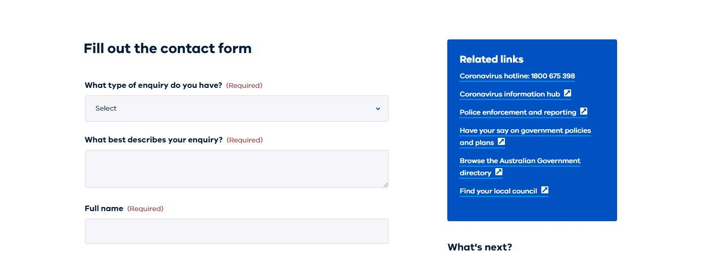

# **2 - Configuration**

The Google Tag Manager Container has been set up to streamline configuration. Under the "Folders" section you will find two key directories:

* #1 - GTM - Configuration Variables
* #2 - GTM - Configuration Advanced

The #1 folder is used for the core settings and required configuration, including key tracking account Id’s. The #2 folder contains advanced configuration that will enable additional tracking, these configurations will require some knowledge of html & CSS to configure correctly.

## **1 - Configure #1 - GTM - Configuration Variables**

Navigate to folders:

* Workspaces > Import base Container
* Left Hand menu > Folders
* Open > **#1 - GTM  - Configuration Variables**

Update values for the following configs (UA ones, only where applicable):

* **Const - UA - ID - Prod - WOVG - Config**
    * The Production Google Analytics Property ID e.g. UA-xxxxxxxxx-x
    * [https://support.google.com/tagmanager/answer/9207621#ga_id](https://support.google.com/tagmanager/answer/9207621#ga_id)

* **Const - UA - ID - Test - WOVG - Config**
    * The Testing/QA Google Analytics Property ID e.g. UA-xxxxxxxxx-x
    * [https://support.google.com/tagmanager/answer/9207621#ga_id](https://support.google.com/tagmanager/answer/9207621#ga_id)
* **Const - GA4 - Measurement ID - Prod - WOVG - Config**
    * The Production Google Analytics 4 Measurement ID e.g. G-xxxxxxxxxx
    * [https://support.google.com/analytics/answer/9304153#zippy=%2Cweb%2Cfind-your-g--id-for-any-platform-that-accepts-a-g--id](https://support.google.com/analytics/answer/9304153#zippy=%2Cweb%2Cfind-your-g--id-for-any-platform-that-accepts-a-g--id)

* **Const - GA4 - Measurement ID - Test - WOVG - Config**
    * The Testing/QA Google Analytics 4 Measurement ID e.g. G-xxxxxxxxxx
    * [https://support.google.com/analytics/answer/9304153#zippy=%2Cweb%2Cfind-your-g--id-for-any-platform-that-accepts-a-g--id](https://support.google.com/analytics/answer/9304153#zippy=%2Cweb%2Cfind-your-g--id-for-any-platform-that-accepts-a-g--id)

* **Const - Hostname - For Website - WOVG - Config**
    * This is the host name of the website the GTM container will be implemented on.
    * No www. Or sub-domains It should just be the domain name

* **Const - Hotjar Site ID - WOVG - Config**
    * [https://www.hotjar.com/](https://www.hotjar.com/)
    * Set a value if the department is using Hotjar
        * Create an account for them if required
    * If not using Hotjar set the value to "0"

* **Const - Page Not Found - Text - WOVG - Config**
    * This should be the literal text found on a 404 not found page.
    * This can either be:
        * a) Page title text
        * b) Text shown to user on page
    * You can access this page by create a fake page path on the domain e.g. /test-404

## **2 - Configure #2 - GTM - Configuration Advanced**

Navigate to folders:

* Workspaces > Import base Container
* Left Hand menu > Folders
* Open > **#2 - GTM - Configuration Advanced**

Update values:

* **CHTML - Scroll - Base - SDP - Config**
    * By default this Tag is paused.
    * If you would like to activate scroll tracking unpause this Tag
    * This Tag contains custom JavaScript that will add functionality to the page to allow GTM to receive user browser scroll events at 50% and 100%

* **CHTML - Scroll - Reset - SDP - Config**
    * By default this Tag is paused.
    * If you would like to activate scroll tracking unpause this Tag
    * This will reset the scroll functionality as required
* **LTR - Scrolling - Activated - Page - WOVG - Config**
    * This variable is a whitelist of pages to track browser scrolling
    * By default no pages are targeted for scrolling
    * Use this variable to target page URLs/paths (via regex) that you would like scrolling to be activated on.
    * This is required as scrolling can add significant volume of hits to Google Analytics and works best when targeted

* **Click - Link - Button - CTA - WOVG - Config**
    * This is already configured for SDP websites
    * Create a CSS selector that targets call to action buttons/links on the website
        * E.g. a.btn, .btn-hero
    * [https://www.w3schools.com/CSSref/CSS_selectors.asp](https://www.w3schools.com/CSSref/CSS_selectors.asp)
    * You can list multiple by using , (commas) to separate the different selectors
    * This should target "buttons" that link users to important content. E.g. Click Here, Download, Visits etc.
    * You can use inspect tools on the website to determine the classes and DOM structure used for these types of buttons/links

* **Click - Link - Footer - WOVG - Config**
    * This is already configured for SDP websites
    * Create a CSS selector that targets the footer links
        * E.g. footer a
    * In most cases the above example will work for most websites
    * Otherwise inspect the websites footer and adjust the selector as required

* **Click - Link - Header - Top - Nav - Home - WOVG - Config**
    * This is already configured for SDP websites
    * Create a CSS selector that targets the home header link

* **Click - Link - Header - Top - Nav - WOVG - Config**
    * This is already configured for SDP websites
    * Create a CSS selector that targets the header links
        * E.g. #nav a

* **Const - Form - CSS - Selector - WOVG - Config**
    * This is already configured for SDP websites
    * Create a CSS selector that targets forms on the website
        * E.g. form.rpl-form
    * The targeted element must be/return the "form" tag
    * Use , (commas) to set different forms
    * This will only target the first form found per page, so please do not include site search forms.

* **Const - Page Not Found - CSS - WOVG - Config**
    * This is already configured for SDP
    * Create a CSS selector that targets the "not found" text holder html element shown on the page
        * E.g. .app-error p.app-error-intro
    * You can access a 404 page by creating a fake page path on the domain e.g. /test-404

* **Const - Query - Accepted - WOVG - Config**
    * This is already configured for SDP to accept the "q" query string parameter for search.
        * E.g. /search?**q**=test
    * By default all page paths are cleared of query strings and anchors (#)
        * This provides clean page paths in Google Analytics and allows for the grouping of pages. Query strings will create unique reporting rows and it  becomes difficult to aggregate totals in page reports.
        * The full query string is captured as Custom Dimension 34 (url.query (h-34))
    * If you would like to add specific query keys to appear in page reports, please add them here.
    * You can add multiple values by using a commer "," e.g. q,page,... etc
* **DOM - Meta - Content Type - WOVG - Config**
    * This is already configured for SDP

* **DOM - Meta - Site Section - WOVG - Config**
    * This is already configured for SDP

* **Const - Body Content - CSS - WOVG - Config**
    * This is already configured for SDP
    * This will be used to calculate the word count for the page excluding navigation.
    * Please use a CSS Selector to target the HTML element on-page that holds the body content. e.g. #rpl-main-content

* **CJS - Content - Breadcrumb - Return Function - SDP - Config**
    * _Update requires developer knowledge (HTML/CSS/JavaScript)_
    * This is already configured for SDP
    * This will be used to set custom definitions for the current content breadcrumbs upto 5 levels
    * Edit the CSS selector “document.querySelectorAll()” to target your breadcrumbs on site/page.
      * You will need to use CSS selectors
      * https://www.w3schools.com/cssref/css_selectors.asp
    * You may also need to adjust the JavaScript depending on your breadcrumb structure and if the first item needs to be removed e.g. “home”

* **CJS - File Download Link - Size - SDP - Config**
    * _Update requires developer knowledge (HTML/CSS/JavaScript)_
    * This is already configured for SDP
    * This will be used to get the file size of the file download document if displayed to the user.
    * Edit the CSS selector “target.querySelector()” to target the html element that holds the file size information.
      * You will need to use CSS selectors
      * https://www.w3schools.com/cssref/css_selectors.asp  
    * You may also need to adjust the JavaScript depending on where and how the file size is displayed to the user.

* **CJS - Content Section Count - SDP - Config**
    * _Update requires developer knowledge (HTML/CSS/JavaScript)_
    * This is already configured for SDP
    * This will be used to get a count of the content sections on the current page.
    * Edit the CSS selector “document.querySelectorAll()” to target the html elements that define each content section
      * You will need to use CSS selectors
      * https://www.w3schools.com/cssref/css_selectors.asp  

* **CJS - Accordion On Page - SDP - Config**
    * _Update requires developer knowledge (HTML/CSS/JavaScript)_
    * This is already configured for SDP
    * This will be used to get a count of the content sections on the current page.
    * Edit the CSS selector “document.querySelector()” to target the html elements that identify an Accordion on page r.g. .rpl-accordion
      * You will need to use CSS selectors
      * https://www.w3schools.com/cssref/css_selectors.asp

* **CJS - Images On Page - Count - Config**
    * _Update requires developer knowledge (HTML/CSS/JavaScript)_
    * This is already configured for SDP
    * This will be used to get a count of images on page
    * Edit (if required) the CSS selector “document.querySelectorAll()” to target the images on page. By default it uses “img” and this should be appropriate for most websites
      *    You will need to use CSS selectors
      *    https://www.w3schools.com/cssref/css_selectors.asp
   
