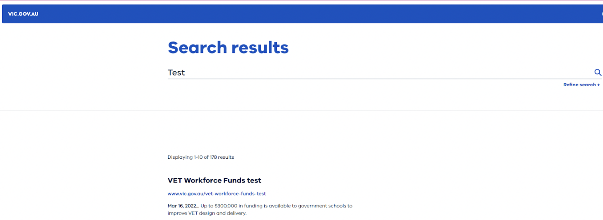
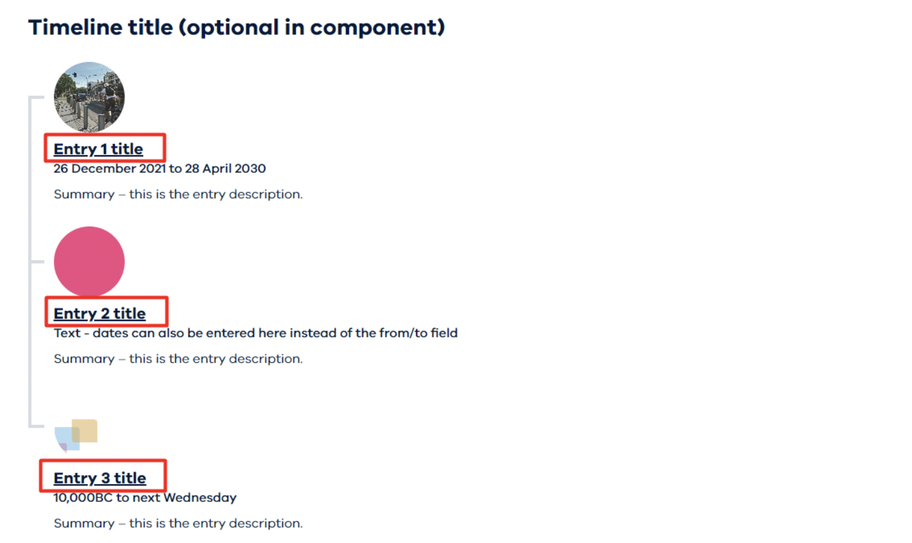
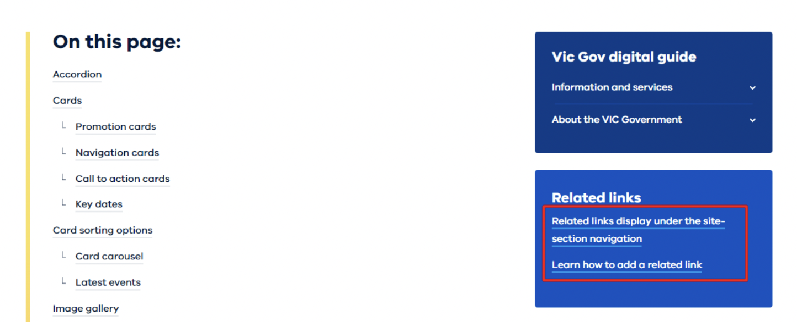
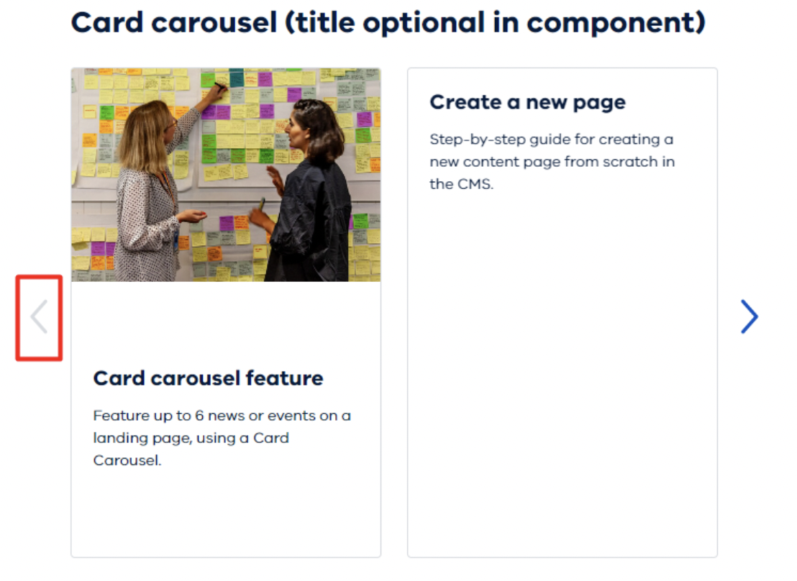
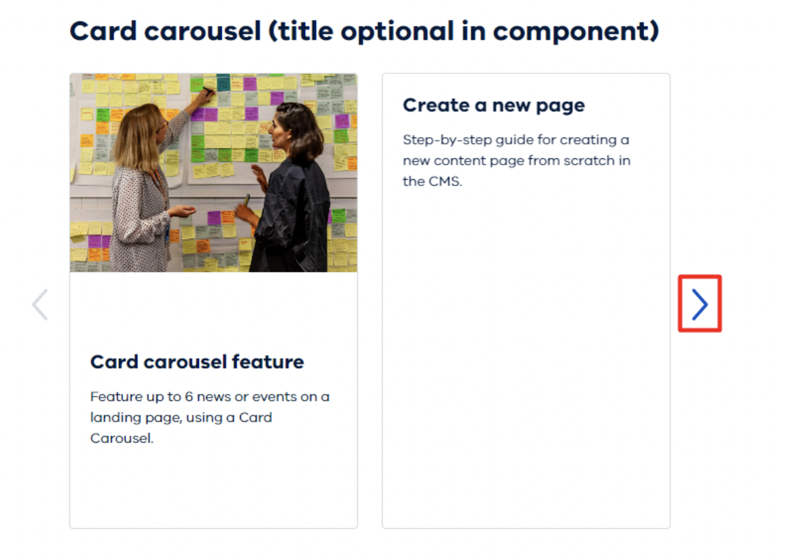

# **Google Analytics 4**
### **GA4 - Configuration**

Move the Configuration tag into the appropriate folder:
* Navigate to Tags section
* Search for "GA4 - Configuration"
* Edit the tag (opens own section)
* Click the Folder Icon
* Select “Website - Non SDP - Support”

Update Triggering:
* Navigate to Triggering
* Click Edit Icon
* Remove “CE - custom.routeChange.update - WOVG”
* Click “Choose a trigger to make…”
* Select “All Pages”

### **GA4 - page_view**

Move the Configuration tag into the appropriate folder:
* Navigate to Tags section
* Search for "GA4 - page_view"
* Edit the tag (opens own section)
* Click the Folder Icon
* Select “Website - Non SDP - Support”

Update Triggering:
* Navigate to Triggering
* Click Edit Icon
* Remove “CE - custom.routeChange.update - WOVG”
* Click “Choose a trigger to make…”
* Select “All Pages”

### **GA4 - Event - Content - Error - Page not found - SDP**

Navigate to Tags:

* Tags
* Search > "GA4 - Event - Content - Error - Page not found - SDP"
* Click Tag

Move Tag to Folder
* Click Folder Icon
* Select "Website - Non SDP - Support"
Update Triggering:
* Navigate to Triggering
* Click Edit Icon
* Remove "CE - routeChange - Page not found - WOVG"
* Click "Choose a trigger to make…"
* Select "Page - DOM Ready - Page Not Found - WOVG"

### **GA4 - Event - Dropdown Open - SDP**
_Update requires developer knowledge (HTML/CSS)_

Move to appropriate folder:
* Navigate to Triggers section
* Search for "Click - Dropdown - Open - SDP"
* Edit the trigger (opens own section)
* Click Folder icon
* Select “Website - Non SDP - Support”

Update Trigger Configuration:
* Navigate to “This trigger fires on”
* Update the trigger configuration to match the html click elements that open the drop down.
* Edit “Fire this trigger…” CSS selector value input
   * You will need to use CSS selectors to target the dropdown click
   * https://www.w3schools.com/cssref/css_selectors.asp
* The entire trigger may need to be adjusted to work with the dropdown/accordion present on the website

### **GA4 - Event - Dropdown Close - SDP**
_Update requires developer knowledge (HTML/CSS)_

Move to appropriate folder:
* Navigate to Triggers section
* Search for "Click - Dropdown - Close - SDP"
* Edit the trigger (opens own section)
* Click Folder icon
* Select “Website - Non SDP - Support”

Update Trigger Configuration:
* Navigate to “This trigger fires on”
* Update the trigger configuration to match the html click elements that close the drop down.
* Edit “Fire this trigger…” CSS selector value input
   * You will need to use CSS selectors to target the dropdown click
   * https://www.w3schools.com/cssref/css_selectors.asp
* The entire trigger may need to be adjusted to work with the dropdown/accordion  present on the website 

### **GA4 - Event - View Search Results - SDP**
_Update requires developer knowledge (HTML/CSS)_

Move to appropriate folder:
* Navigate to Triggers section
* Search for "CE - custom.routeChange.update - with search query"
* Edit the trigger (opens own section)
* Click Folder icon
* Select “Website - Non SDP - Support”

Update Trigger Configuration:
* Navigate to Triggering
* Click Edit Icon
* Remove “CE - custom.routeChange.update - WOVG”
* Click “Add”
* Select “All Pages”
* Update the “Some Conditions” to match the Page URL that indicates the user is on a search results page e.g search.*q=

### **GA4 - Event - Timeline - Click - SDP**
_Update requires developer knowledge (HTML/CSS)_

Move to appropriate folder:
* Navigate to Triggers section
* Search for "Click - Link - Timeline - Link - SDP"
* Edit the trigger (opens own section)
* Click Folder icon
* Select “Website - Non SDP - Support”

Update Trigger Configuration:
* Navigate to “This trigger fires on”
* Update the trigger configuration to match the html click elements that represent a timeline interaction click
* Edit “Fire this trigger…” CSS selector value input
   * You will need to use CSS selectors to target the timeline click
   * https://www.w3schools.com/cssref/css_selectors.asp
* The entire trigger may need to be adjusted to work with the timeline on the target website

 
 
 ### **GA4 - Event - Gallery Enlarge - SDP**
_Update requires developer knowledge (HTML/CSS)_

* Move to appropriate folder:
* Navigate to Triggers section
* Search for "Click - Image Gallery - Enlarge Icon - SDP"
* Edit the trigger (opens own section)
* Click Folder icon
* Select “Website - Non SDP - Support”

Update Trigger Configuration:
* Navigate to “This trigger fires on”
* Update the trigger configuration to match the html click elements that represent a gallery image enlarge action
* Edit “Fire this trigger…” CSS selector value input
   * You will need to use CSS selectors to target the image enlarge click
   * https://www.w3schools.com/cssref/css_selectors.asp
* The entire trigger may need to be adjusted to work with the Image gallery for the target website

 ### **GA4 - Event - Related - Link - Click - SDP**
_Update requires developer knowledge (HTML/CSS)_

Move to appropriate folder:
* Navigate to Triggers section
* Search for "Click - Link - Related Link - SDP"
* Edit the trigger (opens own section)
* Click Folder icon
* Select “Website - Non SDP - Support”

Update Trigger Configuration:
* Navigate to “This trigger fires on”
* Update the trigger configuration to match the html click elements that represent a related link click
* Edit “Fire this trigger…” CSS selector value input
   * You will need to use CSS selectors to target the related link click 
   * https://www.w3schools.com/cssref/css_selectors.asp
The entire trigger may need to be adjusted to work with the related links on the target website

 ### **GA4 - Event - Card Carousel - Left - SDP**
_Update requires developer knowledge (HTML/CSS)_

Move to appropriate folder:
* Navigate to Triggers section
* Search for "Click - Card Carousel - Left - SDP"
* Edit the trigger (opens own section)
* Click Folder icon
* Select “Website - Non SDP - Support”

Update Trigger Configuration:
* Navigate to “This trigger fires on”
* Update the trigger configuration to match the html click elements that represent a related link click
* Edit “Fire this trigger…” CSS selector value input
   * You will need to use CSS selectors to target the left click
   * https://www.w3schools.com/cssref/css_selectors.asp
* The entire trigger may need to be adjusted to work with the related links on the target website

 ### **GA4 - Event - Card Carousel - Right - SDP**
_Update requires developer knowledge (HTML/CSS)_

Move to appropriate folder:
* Navigate to Triggers section
* Search for "Click - Card Carousel - Right - SDP"
* Edit the trigger (opens own section)
* Click Folder icon
* Select “Website - Non SDP - Support”

Update Trigger Configuration:
* Navigate to “This trigger fires on”
* Update the trigger configuration to match the html click elements that represent a related link click
* Edit “Fire this trigger…” CSS selector value input
   * You will need to use CSS selectors to target the left click
   * https://www.w3schools.com/cssref/css_selectors.asp
* The entire trigger may need to be adjusted to work with the related links on the target website

 ### **CHTML - Utility - dataLayer - Engagement**
 This advanced Tag will add functionality to flag user engagement on each page.
It will base this on two factors, the footer being visible and a timer based on how many words are on page.

Move to appropriate folder:
* Navigate to Tags section
* Search for "CHTML - Utility - dataLayer - Engagement"
* Edit the trigger (opens own section)
* Click Folder icon
* Select “Website - Non SDP - Support”

Update Trigger Configuration:
* Navigate to Triggering
* Click Edit Icon
* Remove “CE - custom.routeChange.update - WOVG”
* Click “Add” (+)
* Select “All Pages”

**Update EV - Footer Trigger:**

Move to appropriate folder:
* Navigate to Triggers section
* Search for "EV - Footer"
* Edit the trigger (opens own section)
* Click Folder icon
* Select “Website - Non SDP - Support”

Update Trigger Configuration:
* Click Edit Icon
* Check the Element Selector value “footer” is correct for the target website. Update this value as required
   * “Footer” should be applicable in most cases
