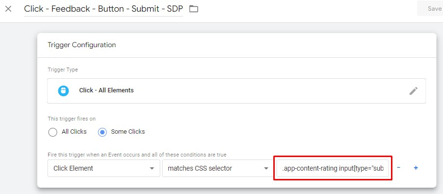
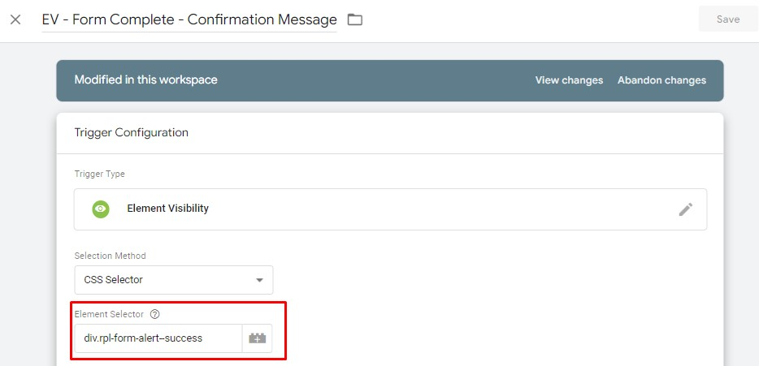
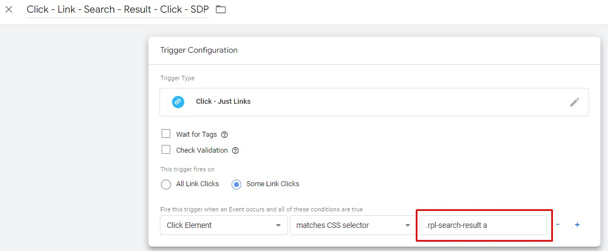

# **4 - Non SDP Configuration Support**
**IMPORTANT**: Non SDP websites are assumed to also be non-SPA (non single page application) for the purposes of page navigation. If you are setting up GTM tracking for a Non SDP website that is an SPA website, please get in touch at analytics.team@dpc.vic.gov.au for additional guidance, as some of the below configurations will need to be different.

The below heading names mirror the names of the tags in the GTM container for easier reference. For each of these tags, please make the updates as listed.

## **Universal Analytics (if applicable)**
### **GA - Event - Error - Content - 404 - SDP**

Navigate to Tags:

* Tags
* Search > "GA - Event - Error - Content - 404 - SDP"
* Click Tag

Move Tag to Folder

* Click Folder Icon
* Select "Website - Non SDP - Support"

Update Triggering:

* Navigate to Triggering
* Click Edit Icon
* Remove "CE - routeChange - Page not found - WOVG"
* Click "Choose a trigger to make…"
* Select "Page - DOM Ready - Page Not Found - WOVG"

### **GA - Pageview - WOVG**
Navigate to Tags:
* Tags
* Search > “GA - Pageview - WOVG”
* Click Tag

Update Paused:
* Click “Unpause”

Navigate to Tags:
* Tags
* Search > “GA - Pageview - Route Change - WOVG”
* Click Tag

Update Paused:
* Click “Stacked Dots” (Next to Save button in the top right)
* From the menu click “Pause”

### **GA - Event - Content - Feedback - Cancel - SDP**

**_Update requires developer knowledge (HTML/CSS/JavaScript)_**

Navigate to Tags:

* Tags
* Search > "GA - Event - Content - Feedback - Cancel - SDP"
* Click Tag

Update Triggering:

* Navigate to Triggering
* Click Trigger "Click - Feedback - Button - Cancel - SDP"
* Edit "Fire this trigger…" CSS selector value input
    * You will need to use CSS selectors to target the cancel button on your feedback form.
    * [https://www.w3schools.com/CSSref/CSS_selectors.asp](https://www.w3schools.com/CSSref/CSS_selectors.asp)

Move Trigger to Folder

* Click Folder Icon
* Select "Website - Non SDP - Support"

Update Variable :

* Navigate to Variables
* Scroll down to "User-Defined Variables"
* Search for "CJS - Feedback Form - Yes/No status"
* Click "CJS - Feedback Form - Yes/No status"
* Edit "document.querySelector" to target your yes/no opinion.
    * Adjust Custom Javascript as required
    * Return value should be "yes" or "no" or "no-value"

Move Variable to Folder

* Click Folder Icon
* Select "Website - Non SDP - Support"

### **GA - Event - Content - Feedback - SDP**

**_Update requires developer knowledge (HTML/CSS/JavaScript)_**

Navigate to Tags:

* Tags
* Search > "GA - Event - Content - Feedback - SDP"
* Click Tag

Update Triggering:

* Navigate to Triggering
* Click Trigger "Click - Radio Button - SDP"
* Edit "Fire this trigger…" CSS selector value input
    * You will need to use CSS selectors to target the feedback value selection element
    * [https://www.w3schools.com/CSSref/CSS_selectors.asp](https://www.w3schools.com/CSSref/CSS_selectors.asp)

Move Trigger to Folder

* Click Folder Icon
* Select "Website - Non SDP - Support"

Update Variable :

* Navigate to Variables
* Scroll down to "User-Defined Variables"
* Search for "CJS - Form - Radio - Value - SDP"
* Click "CJS - Form - Radio - Value - SDP"
* Edit custom JavaScript to target the user feedback selection element.
* Return value should be "yes" or "no" or "no-value"

Move Variable to Folder

* Click Folder Icon
* Select "Website - Non SDP - Support"

### **GA - Event - Content - Feedback - Submit - SDP**

**_Update requires developer knowledge (HTML/CSS)_**

Navigate to Tags:

* Tags
* Search > "GA - Event - Content - Feedback - SDP"
* Click Tag

Update Triggering:

* Navigate to Triggering
* Click Trigger "Click - Feedback - Button - Submit - SDP"
* Edit "Fire this trigger…" CSS selector value input
    * You will need to use CSS selectors to target the form feedback submit button
    * [https://www.w3schools.com/CSSref/CSS_selectors.asp](https://www.w3schools.com/CSSref/CSS_selectors.asp)

Move Trigger to Folder

* Click Folder Icon
* Select "Website - Non SDP - Support"

### **GA - Event - Form - Complete - WOVG**

**_Update requires developer knowledge (HTML/CSS)_**

Navigate to Tags:

* Tags
* Search > "GA - Event - Form - Complete - WOVG"
* Click Tag

Update Triggering:

* Navigate to Triggering
* Click Trigger "EV - Form Complete - Confirmation Message"
* Edit "Element Selector"
    * You will need to use CSS selectors to target the form success/complete message element that is displayed to the user.
    * [https://www.w3schools.com/CSSref/CSS_selectors.asp](https://www.w3schools.com/CSSref/CSS_selectors.asp)

Move Trigger to Folder

* Click Folder Icon
* Select "Website - Non SDP - Support"

### **GA - Event - Navigation - SDP**

**_Update requires developer knowledge (HTML/CSS)_**

Update Variable :

* Navigate to Variables
* Scroll down to "User-Defined Variables"
* Search for "LTR - Navigation Types - SDP"
* Click "LTR - Navigation Types - SDP"
* Edit the "RegEx Table" "Patterns"
    * Do not change the output
    * Change the RegEx patterns to target the html elements that best represent the Output value for each row.

Move Variable to Folder

* Click Folder Icon
* Select "Website - Non SDP - Support"

### **GA - Event - Navigation - Search - Result - Click - SDP**

**_Update requires developer knowledge (HTML/CSS)_**

Navigate to Tags:

* Tags
* Search > "GA - Event - Navigation - Search - Result - Click - SDP"
* Click Tag

Update Triggering:

* Navigate to Triggering
* Click Trigger "Click - Link - Search - Result - Click - SDP"
* Edit "Fire this trigger…" CSS selector value input
    * You will need to use CSS selectors to target the search result click
    * [https://www.w3schools.com/CSSref/CSS_selectors.asp](https://www.w3schools.com/CSSref/CSS_selectors.asp)

Move Trigger to Folder

* Click Folder Icon
* Select "Website - Non SDP - Support"

### **GA - Event - Social Media Share - SDP**

**_Update requires developer knowledge (HTML/CSS)_**

Navigate to Tags:

* Tags
* Search > "GA - Event - Social Media Share - SDP"
* Click Tag

Update Triggering:

* Navigate to Triggering
* Click Trigger "Click - Social Media - SDP"
* Edit "Fire this trigger…" CSS selector value input
    * You will need to use CSS selectors to target the social share links
    * [https://www.w3schools.com/CSSref/CSS_selectors.asp](https://www.w3schools.com/CSSref/CSS_selectors.asp)

Move Trigger to Folder

* Click Folder Icon
* Select "Website - Non SDP - Support"

Update Variable :

* Navigate to Variables
* Scroll down to "User-Defined Variables"
* Search for "CJS - Social - Media - Source - SDP"
* Click "CJS - Social - Media - Source - SDP"
* Edit custom JavaScript to target the social share links
    * The current setup uses the clicked text, however you can adjust the code to what is required for social shares.
* Return values are:
    * Twitter, Facebook, LinkedIn
    * "no-value"

Move Variable to Folder
* Click Folder Icon
* Select "Website - Non SDP - Support"

## **Google Analytics 4**
### **GA4 - Configuration**

Move the Configuration tag into the appropriate folder:
* Navigate to Tags section
* Search for "GA4 - Configuration"
* Edit the tag (opens own section)
* Click the Folder Icon
* Select “Website - Non SDP - Support”

Update Triggering:
* Navigate to Triggering
* Click Edit Icon
* Remove “CE - custom.routeChange.update - WOVG”
* Click “Choose a trigger to make…”
* Select “All Pages”

### **GA4 - page_view**

Move the Configuration tag into the appropriate folder:
* Navigate to Tags section
* Search for "GA4 - page_view"
* Edit the tag (opens own section)
* Click the Folder Icon
* Select “Website - Non SDP - Support”

Update Triggering:
* Navigate to Triggering
* Click Edit Icon
* Remove “CE - custom.routeChange.update - WOVG”
* Click “Choose a trigger to make…”
* Select “All Pages”

### **GA4 - Event - Content - Error - Page not found - SDP**

Navigate to Tags:

* Tags
* Search > "GA4 - Event - Content - Error - Page not found - SDP"
* Click Tag

Move Tag to Folder
* Click Folder Icon
* Select "Website - Non SDP - Support"
Update Triggering:
* Navigate to Triggering
* Click Edit Icon
* Remove "CE - routeChange - Page not found - WOVG"
* Click "Choose a trigger to make…"
* Select "Page - DOM Ready - Page Not Found - WOVG"

### **GA4 - Event - Dropdown Open - SDP**
_Update requires developer knowledge (HTML/CSS)_

Move to appropriate folder:
* Navigate to Triggers section
* Search for "Click - Dropdown - Open - SDP"
* Edit the trigger (opens own section)
* Click Folder icon
* Select “Website - Non SDP - Support”

Update Trigger Configuration:
* Navigate to “This trigger fires on”
* Update the trigger configuration to match the html click elements that open the drop down.
* Edit “Fire this trigger…” CSS selector value input
   * You will need to use CSS selectors to target the dropdown click
   * https://www.w3schools.com/cssref/css_selectors.asp
* The entire trigger may need to be adjusted to work with the dropdown/accordion present on the website

### **GA4 - Event - Dropdown Close - SDP**
_Update requires developer knowledge (HTML/CSS)_

Move to appropriate folder:
* Navigate to Triggers section
* Search for "Click - Dropdown - Close - SDP"
* Edit the trigger (opens own section)
* Click Folder icon
* Select “Website - Non SDP - Support”

Update Trigger Configuration:
* Navigate to “This trigger fires on”
* Update the trigger configuration to match the html click elements that close the drop down.
* Edit “Fire this trigger…” CSS selector value input
   * You will need to use CSS selectors to target the dropdown click
   * https://www.w3schools.com/cssref/css_selectors.asp
* The entire trigger may need to be adjusted to work with the dropdown/accordion  present on the website 

### **GA4 - Event - View Search Results - SDP**
_Update requires developer knowledge (HTML/CSS)_

Move to appropriate folder:
* Navigate to Triggers section
* Search for "CE - custom.routeChange.update - with search query"
* Edit the trigger (opens own section)
* Click Folder icon
* Select “Website - Non SDP - Support”

Update Trigger Configuration:
* Navigate to Triggering
* Click Edit Icon
* Remove “CE - custom.routeChange.update - WOVG”
* Click “Add”
* Select “All Pages”
* Update the “Some Conditions” to match the Page URL that indicates the user is on a search results page e.g search.*q=

### **GA4 - Event - Timeline - Click - SDP**
_Update requires developer knowledge (HTML/CSS)_

Move to appropriate folder:
* Navigate to Triggers section
* Search for "Click - Link - Timeline - Link - SDP"
* Edit the trigger (opens own section)
* Click Folder icon
* Select “Website - Non SDP - Support”

Update Trigger Configuration:
* Navigate to “This trigger fires on”
* Update the trigger configuration to match the html click elements that represent a timeline interaction click
* Edit “Fire this trigger…” CSS selector value input
   * You will need to use CSS selectors to target the timeline click
   * https://www.w3schools.com/cssref/css_selectors.asp
* The entire trigger may need to be adjusted to work with the timeline on the target website

 
 
 ### **GA4 - Event - Gallery Enlarge - SDP**
_Update requires developer knowledge (HTML/CSS)_

* Move to appropriate folder:
* Navigate to Triggers section
* Search for "Click - Image Gallery - Enlarge Icon - SDP"
* Edit the trigger (opens own section)
* Click Folder icon
* Select “Website - Non SDP - Support”

Update Trigger Configuration:
* Navigate to “This trigger fires on”
* Update the trigger configuration to match the html click elements that represent a gallery image enlarge action
* Edit “Fire this trigger…” CSS selector value input
   * You will need to use CSS selectors to target the image enlarge click
   * https://www.w3schools.com/cssref/css_selectors.asp
* The entire trigger may need to be adjusted to work with the Image gallery for the target website

 ### **GA4 - Event - Related - Link - Click - SDP**
_Update requires developer knowledge (HTML/CSS)_

Move to appropriate folder:
* Navigate to Triggers section
* Search for "Click - Link - Related Link - SDP"
* Edit the trigger (opens own section)
* Click Folder icon
* Select “Website - Non SDP - Support”

Update Trigger Configuration:
* Navigate to “This trigger fires on”
* Update the trigger configuration to match the html click elements that represent a related link click
* Edit “Fire this trigger…” CSS selector value input
   * You will need to use CSS selectors to target the related link click 
   * https://www.w3schools.com/cssref/css_selectors.asp
The entire trigger may need to be adjusted to work with the related links on the target website

 ### **GA4 - Event - Card Carousel - Left - SDP**
_Update requires developer knowledge (HTML/CSS)_

Move to appropriate folder:
* Navigate to Triggers section
* Search for "Click - Card Carousel - Left - SDP"
* Edit the trigger (opens own section)
* Click Folder icon
* Select “Website - Non SDP - Support”

Update Trigger Configuration:
* Navigate to “This trigger fires on”
* Update the trigger configuration to match the html click elements that represent a related link click
* Edit “Fire this trigger…” CSS selector value input
   * You will need to use CSS selectors to target the left click
   * https://www.w3schools.com/cssref/css_selectors.asp
* The entire trigger may need to be adjusted to work with the related links on the target website

 ### **GA4 - Event - Card Carousel - Right - SDP**
_Update requires developer knowledge (HTML/CSS)_

Move to appropriate folder:
* Navigate to Triggers section
* Search for "Click - Card Carousel - Right - SDP"
* Edit the trigger (opens own section)
* Click Folder icon
* Select “Website - Non SDP - Support”

Update Trigger Configuration:
* Navigate to “This trigger fires on”
* Update the trigger configuration to match the html click elements that represent a related link click
* Edit “Fire this trigger…” CSS selector value input
   * You will need to use CSS selectors to target the left click
   * https://www.w3schools.com/cssref/css_selectors.asp
* The entire trigger may need to be adjusted to work with the related links on the target website

 ### **CHTML - Utility - dataLayer - Engagement**
 This advanced Tag will add functionality to flag user engagement on each page.
It will base this on two factors, the footer being visible and a timer based on how many words are on page.

Move to appropriate folder:
* Navigate to Tags section
* Search for "CHTML - Utility - dataLayer - Engagement"
* Edit the trigger (opens own section)
* Click Folder icon
* Select “Website - Non SDP - Support”

Update Trigger Configuration:
* Navigate to Triggering
* Click Edit Icon
* Remove “CE - custom.routeChange.update - WOVG”
* Click “Add” (+)
* Select “All Pages”

**Update EV - Footer Trigger:**

Move to appropriate folder:
* Navigate to Triggers section
* Search for "EV - Footer"
* Edit the trigger (opens own section)
* Click Folder icon
* Select “Website - Non SDP - Support”

Update Trigger Configuration:
* Click Edit Icon
* Check the Element Selector value “footer” is correct for the target website. Update this value as required
   * “Footer” should be applicable in most cases

