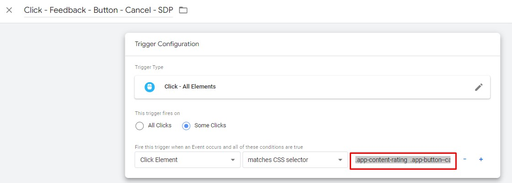
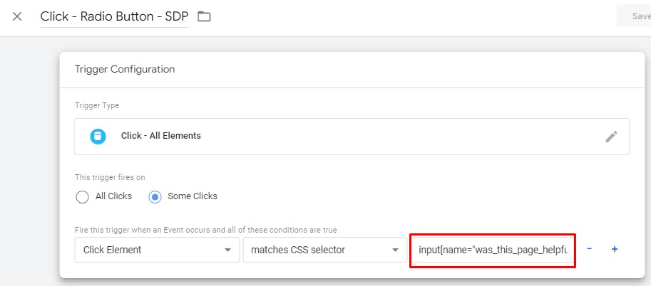
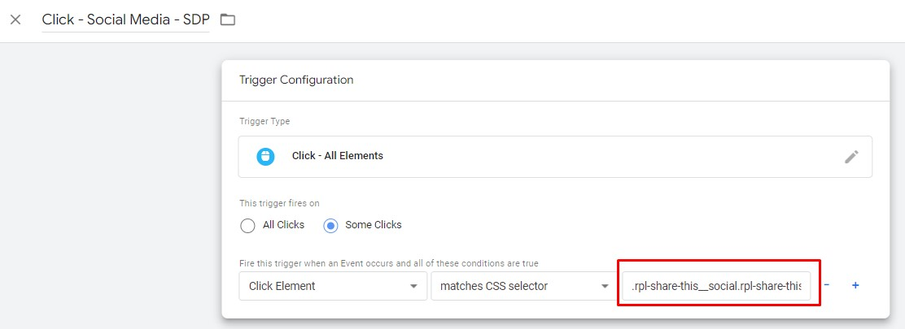

# **Google Analytics 4 Configuration**

** Before you begin this implementation, you will need to ensure that there is a GA4 property set up in Google Analytics. If there is no property configured, or to ensure your existing property is set up to work with this GTM container, please refer to the [WoVG - GA4 Property Configuration - Base Container Version March 2022 document.](https://drive.google.com/file/d/1BQddlDjEGA1CBoUZnXIDNeSd354ExqNW/view?usp=sharing) **

## **GA - Pageview - WOVG**

Navigate to Tags:

* Tags
* Search > "GA - Pageview - WOVG"
* Click Tag

Update Paused:

* Click "Unpause"

Navigate to Tags:

* Tags
* Search > "GA - Pageview - Route Change - WOVG"
* Click Tag

Update Paused:

* Click "Stacked Dots" (Next to Save button in the top right)
* From the menu click "Pause"

## **GA - Event - Content - Feedback - Cancel - SDP**

**_Update requires developer knowledge (HTML/CSS/JavaScript)_**

Navigate to Tags:

* Tags
* Search > "GA - Event - Content - Feedback - Cancel - SDP"
* Click Tag

Update Triggering:

* Navigate to Triggering
* Click Trigger "Click - Feedback - Button - Cancel - SDP"
* Edit "Fire this trigger…" CSS selector value input
    * You will need to use CSS selectors to target the cancel button on your feedback form.
    * [https://www.w3schools.com/CSSref/CSS_selectors.asp](https://www.w3schools.com/CSSref/CSS_selectors.asp)

Move Trigger to Folder

* Click Folder Icon
* Select "Website - Non SDP - Support"

Update Variable :

* Navigate to Variables
* Scroll down to "User-Defined Variables"
* Search for "CJS - Feedback Form - Yes/No status"
* Click "CJS - Feedback Form - Yes/No status"
* Edit "document.querySelector" to target your yes/no opinion.
    * Adjust Custom Javascript as required
    * Return value should be "yes" or "no" or "no-value"

Move Variable to Folder

* Click Folder Icon
* Select "Website - Non SDP - Support"

## **GA - Event - Content - Feedback - SDP**

**_Update requires developer knowledge (HTML/CSS/JavaScript)_**

Navigate to Tags:

* Tags
* Search > "GA - Event - Content - Feedback - SDP"
* Click Tag

Update Triggering:

* Navigate to Triggering
* Click Trigger "Click - Radio Button - SDP"
* Edit "Fire this trigger…" CSS selector value input
    * You will need to use CSS selectors to target the feedback value selection element
    * [https://www.w3schools.com/CSSref/CSS_selectors.asp](https://www.w3schools.com/CSSref/CSS_selectors.asp)

Move Trigger to Folder

* Click Folder Icon
* Select "Website - Non SDP - Support"

Update Variable :

* Navigate to Variables
* Scroll down to "User-Defined Variables"
* Search for "CJS - Form - Radio - Value - SDP"
* Click "CJS - Form - Radio - Value - SDP"
* Edit custom JavaScript to target the user feedback selection element.
* Return value should be "yes" or "no" or "no-value"

Move Variable to Folder

* Click Folder Icon
* Select "Website - Non SDP - Support"

## **GA - Event - Content - Feedback - Submit - SDP**

**_Update requires developer knowledge (HTML/CSS)_**

Navigate to Tags:

* Tags
* Search > "GA - Event - Content - Feedback - SDP"
* Click Tag

Update Triggering:

* Navigate to Triggering
* Click Trigger "Click - Feedback - Button - Submit - SDP"
* Edit "Fire this trigger…" CSS selector value input
    * You will need to use CSS selectors to target the form feedback submit button
    * [https://www.w3schools.com/CSSref/CSS_selectors.asp](https://www.w3schools.com/CSSref/CSS_selectors.asp)

Move Trigger to Folder

* Click Folder Icon
* Select "Website - Non SDP - Support"

## **GA - Event - Form - Complete - WOVG**

**_Update requires developer knowledge (HTML/CSS)_**

Navigate to Tags:

* Tags
* Search > "GA - Event - Form - Complete - WOVG"
* Click Tag

Update Triggering:

* Navigate to Triggering
* Click Trigger "EV - Form Complete - Confirmation Message"
* Edit "Element Selector"
    * You will need to use CSS selectors to target the form success/complete message element that is displayed to the user.
    * [https://www.w3schools.com/CSSref/CSS_selectors.asp](https://www.w3schools.com/CSSref/CSS_selectors.asp)

Move Trigger to Folder

* Click Folder Icon
* Select "Website - Non SDP - Support"

## **GA - Event - Navigation - SDP**

**_Update requires developer knowledge (HTML/CSS)_**

Update Variable :

* Navigate to Variables
* Scroll down to "User-Defined Variables"
* Search for "LTR - Navigation Types - SDP"
* Click "LTR - Navigation Types - SDP"
* Edit the "RegEx Table" "Patterns"
    * Do not change the output
    * Change the RegEx patterns to target the html elements that best represent the Output value for each row.

Move Variable to Folder

* Click Folder Icon
* Select "Website - Non SDP - Support"

## **GA - Event - Navigation - Search - Result - Click - SDP**

**_Update requires developer knowledge (HTML/CSS)_**

Navigate to Tags:

* Tags
* Search > "GA - Event - Navigation - Search - Result - Click - SDP"
* Click Tag

Update Triggering:

* Navigate to Triggering
* Click Trigger "Click - Link - Search - Result - Click - SDP"
* Edit "Fire this trigger…" CSS selector value input
    * You will need to use CSS selectors to target the search result click
    * [https://www.w3schools.com/CSSref/CSS_selectors.asp](https://www.w3schools.com/CSSref/CSS_selectors.asp)

Move Trigger to Folder

* Click Folder Icon
* Select "Website - Non SDP - Support"

## **GA - Event - Social Media Share - SDP**

**_Update requires developer knowledge (HTML/CSS)_**

Navigate to Tags:

* Tags
* Search > "GA - Event - Navigation - Search - Result - Click - SDP"
* Click Tag

Update Triggering:

* Navigate to Triggering
* Click Trigger "Click - Social Media - SDP"
* Edit "Fire this trigger…" CSS selector value input
    * You will need to use CSS selectors to target the social share links
    * [https://www.w3schools.com/CSSref/CSS_selectors.asp](https://www.w3schools.com/CSSref/CSS_selectors.asp)

Move Trigger to Folder

* Click Folder Icon
* Select "Website - Non SDP - Support"

Update Variable :

* Navigate to Variables
* Scroll down to "User-Defined Variables"
* Search for "CJS - Social - Media - Source - SDP"
* Click "CJS - Social - Media - Source - SDP"
* Edit custom JavaScript to target the social share links
    * The current setup uses the clicked text, however you can adjust the code to what is required for social shares.
* Return values are:
    * Twitter, Facebook, LinkedIn
    * "no-value"

Move Variable to Folder
* Click Folder Icon
* Select "Website - Non SDP - Support"

## **GA4 - Configuration**

Navigate to Tags:

* Tags
* Search > "GA4 - Configuration"
* Click Tag

Move Tag to Folder

* Click Folder Icon
* Select "Website - Non SDP - Support"

Update Triggering:
* Navigate to Triggering
* Click Edit Icon
* Remove "CE - custom.routeChange.update - WOVG"
* Click "Choose a trigger to make…"
* Select "All Pages"

## **GA4 - Event - Content - Error - Page not found - SDP**

Navigate to Tags:

* Tags
* Search > "GA4 - Event - Content - Error - Page not found - SDP"
* Click Tag

Move Tag to Folder
* Click Folder Icon
* Select "Website - Non SDP - Support"
Update Triggering:
* Navigate to Triggering
* Click Edit Icon
* Remove "CE - routeChange - Page not found - WOVG"
* Click "Choose a trigger to make…"
* Select "Page - DOM Ready - Page Not Found - WOVG"
