# Set up and report performance measurement for the WoVG with Google Tag Manager
Use these instructions to comply with the mandatory standard for the Victorian government for adding the Google Analytics tracking code to your website.

## Configure Google Tag Manager (GTM)
Use Google Tag Manager to manage tags (such as measurement and marketing optimization JavaScript tags) on your site. Without editing your site code, you use the GTM user interface to add and update Google Ads, Google Analytics, Floodlight, and non-Google tags. This reduces errors and allows you to deploy tags on your site quickly.
Google Tag Manager replaces all your measurement and marketing tags with a single, asynchronously loading tag—so your tags can fire faster without getting in each other’s way.

### Google Tag Manager Account Creation
If your agency or department doesn’t have a GTM account, follow [these instructions from Google](https://support.google.com/tagmanager/answer/6103696?hl=en).

#### GTM Naming Convention
This is the WoVG naming convention for Google Tag Manager containers.

Please create your GTM Container under your Departmental GTM Account. If you are unsure how to access this account please reach out to the [DPC Analytics team](https://digital-engagement.atlassian.net/servicedesk/customer/portal/11/group/16/create/69) or the team that manages your analytics.

Use your primary domain name, don’t include the www from the hostname.

For the Department of Premier and Cabinet, this would be:
- **dpc.vic.gov.au**

# **1 - Initial Setup/Import**
## **1 - Download the GTM Container Template**

Access GTM Container Template:
* [Template-WoVG-v3.0.json](Template-WoVG-v3.0.json)
* Or search for GTM Container ID: GTM-W4PSLLQ

## **2 - A - New - Import - GTM - Container Template**

Access Department GTM Container:

* [https://tagmanager.google.com](https://tagmanager.google.com)
* Search for your website's GTM Container
* If a GTM Container does not exist you will need to create one under the WoVG 360 GTM Account Contact the [DPC Analytics Team](https://digital-engagement.atlassian.net/servicedesk/customer/portal/11/group/16/create/69) or your Webmaster.

Import GTM Container JSON:

* Admin > Container > Import Container
* Import Container > Select file to import > select downloaded JSON e.g. Template-WoVG-v3.0.json
* Import Container > Choose workspace > New
    * Provide a Name e.g. Import base Container
* Import Container > Choose an import option > Override
* Import Container > Preview and confirm your import > Confirm

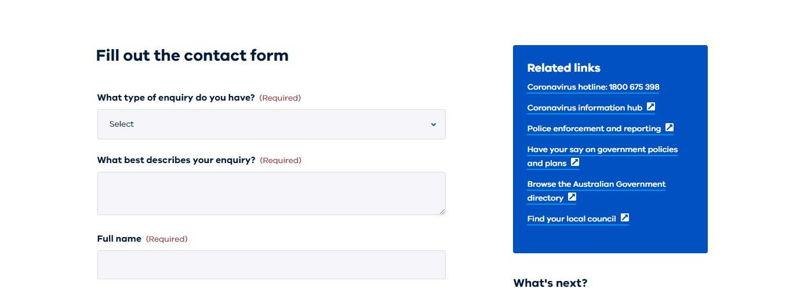

## **2 - B - Existing - Import - GTM - Container Template**

**Please note importing and merging/overriding will overwrite existing configurations when they have the same name.**

If you have an existing GTM container with configurations, this process will be more involved.

You will need to merge the new import into the existing container. This can and will overwrite existing configurations if they share the same name. It is important that you select the import option "Merge" & "Override" rather than make copies. Copies may be a safer option, however you will end up with significant duplication of configurations.

This also means configurations like tracking Id’s will be replaced with placeholders, so you will need to **review the configuration folders and ensure all settings are correct after the import.**

Access Department GTM Container:

* [https://tagmanager.google.com](https://tagmanager.google.com)
* Search for your website's GTM Container
* If a GTM Container does not exist you will need to create one under the WoVG 360 GTM Account Contact the [DPC Analytics Team](https://digital-engagement.atlassian.net/servicedesk/customer/portal/11/group/16/create/69) or your Webmaster.

Import GTM Container JSON:

* Admin > Container > Import Container
* Import Container > Select file to import > select downloaded JSON e.g. Template-WoVG-v3.0.json
* Import Container > Choose workspace > New
    * Provide a Name e.g. Import base Container
* Import Container > Choose an import option > Merge > Overwrite conflicting tags...
* Import Container > Preview and confirm your import > Confirm

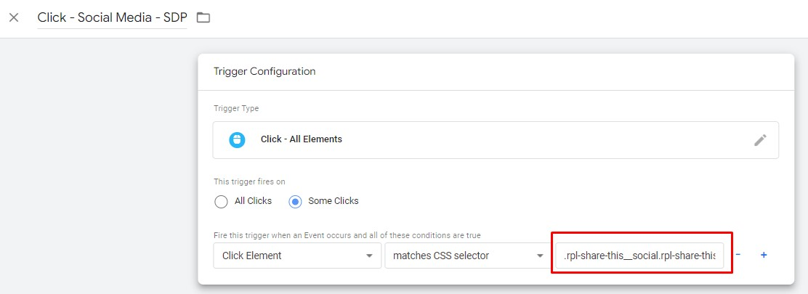

# **2 - Configuration**

The Google Tag Manager Container has been set up to streamline configuration. Under the "Folders" section you will find two key directories:

* #1 - GTM - Configuration Variables
* #2 - GTM - Configuration Advanced

The #1 folder is used for the core settings and required configuration, including key tracking account Id’s. The #2 folder contains advanced configuration that will enable additional tracking, these configurations will require some knowledge of html & CSS to configure correctly.

## **1 - Configure #1 - GTM - Configuration Variables**

Navigate to folders:

* Workspaces > Import base Container
* Left Hand menu > Folders
* Open > **#1 - GTM  - Configuration Variables**

Update values:

* **Const - UA - ID - Prod - WOVG - Config**
    * The Production Google Analytics Property ID e.g. UA-xxxxxxxxx-x
    * [https://support.google.com/tagmanager/answer/9207621#ga_id](https://support.google.com/tagmanager/answer/9207621#ga_id)

* **Const - UA - ID - Test - WOVG - Config**
    * The Testing/QA Google Analytics Property ID e.g. UA-xxxxxxxxx-x
    * [https://support.google.com/tagmanager/answer/9207621#ga_id](https://support.google.com/tagmanager/answer/9207621#ga_id)
* **Const - GA4 - Measurement ID - Prod - WOVG - Config**
    * The Production Google Analytics 4 Measurement ID e.g. G-xxxxxxxxxx
    * [https://support.google.com/analytics/answer/9304153#zippy=%2Cweb%2Cfind-your-g--id-for-any-platform-that-accepts-a-g--id](https://support.google.com/analytics/answer/9304153#zippy=%2Cweb%2Cfind-your-g--id-for-any-platform-that-accepts-a-g--id)

* **Const - GA4 - Measurement ID - Test - WOVG - Config**
    * The Testing/QA Google Analytics 4 Measurement ID e.g. G-xxxxxxxxxx
    * [https://support.google.com/analytics/answer/9304153#zippy=%2Cweb%2Cfind-your-g--id-for-any-platform-that-accepts-a-g--id](https://support.google.com/analytics/answer/9304153#zippy=%2Cweb%2Cfind-your-g--id-for-any-platform-that-accepts-a-g--id)

* **Const - Hostname - For Website - WOVG - Config**
    * This is the host name of the website the GTM container will be implemented on.
    * No www. Or sub-domains It should just be the domain name

* **Const - Hotjar Site ID - WOVG - Config**
    * [https://www.hotjar.com/](https://www.hotjar.com/)
    * Set a value if the department is using Hotjar
        * Create an account for them if required
    * If not using Hotjar set the value to "0"

* **Const - Page Not Found - Text - WOVG - Config**
    * This should be the literal text found on a 404 not found page.
    * This can either be:
        * a) Page title text
        * b) Text shown to user on page
    * You can access this page by create a fake page path on the domain e.g. /test-404

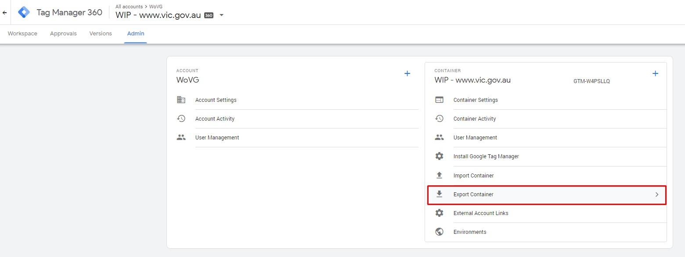

## **2 - Configure #2 - GTM - Configuration Advanced**

Navigate to folders:

* Workspaces > Import base Container
* Left Hand menu > Folders
* Open > **#2 - GTM - Configuration Advanced**

Update values:

* **CHTML - Scroll - Base - SDP - Config**
    * By default this Tag is paused.
    * If you would like to activate scroll tracking unpause this Tag
    * This Tag contains custom JavaScript that will add functionality to the page to allow GTM to receive user browser scroll events at 50% and 100%

* **CHTML - Scroll - Reset - SDP - Config**
    * By default this Tag is paused.
    * If you would like to activate scroll tracking unpause this Tag
    * This will reset the scroll functionality as required
* **LTR - Scrolling - Activated - Page - WOVG - Config**
    * This variable is a whitelist of pages to track browser scrolling
    * By default no pages are targeted for scrolling
    * Use this variable to target page URLs/paths (via regex) that you would like scrolling to be activated on.
    * This is required as scrolling can add significant volume of hits to Google Analytics and works best when targeted

* **Click - Link - Button - CTA - WOVG - Config**
    * This is already configured for SDP websites
    * Create a CSS selector that targets call to action buttons/links on the website
        * E.g. a.btn, .btn-hero
    * [https://www.w3schools.com/CSSref/CSS_selectors.asp](https://www.w3schools.com/CSSref/CSS_selectors.asp)
    * You can list multiple by using , (commas) to separate the different selectors
    * This should target "buttons" that link users to important content. E.g. Click Here, Download, Visits etc.
    * You can use inspect tools on the website to determine the classes and DOM structure used for these types of buttons/links

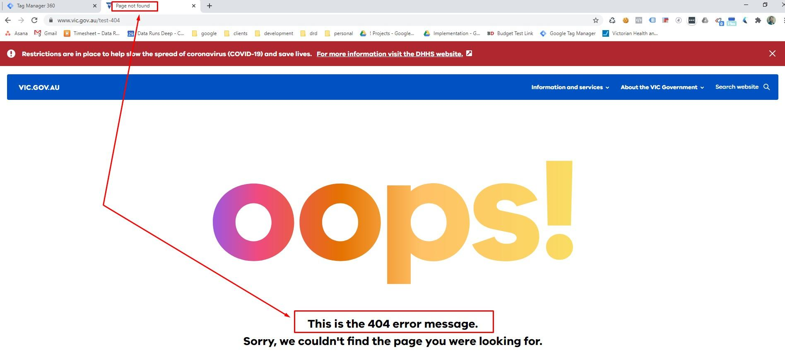

* **Click - Link - Footer - WOVG - Config**
    * This is already configured for SDP websites
    * Create a CSS selector that targets the footer links
        * E.g. footer a
    * In most cases the above example will work for most websites
    * Otherwise inspect the websites footer and adjust the selector as required

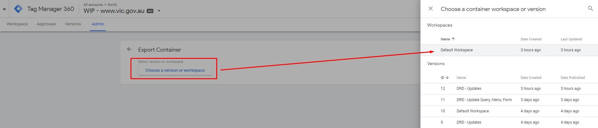

* **Click - Link - Header - Top - Nav - Home - WOVG - Config**
    * This is already configured for SDP websites
    * Create a CSS selector that targets the home header link

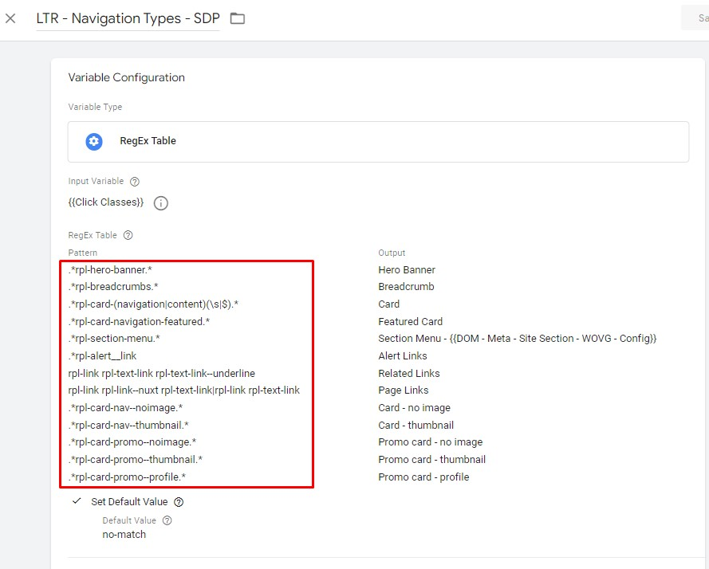

* **Click - Link - Header - Top - Nav - WOVG - Config**
    * This is already configured for SDP websites
    * Create a CSS selector that targets the header links
        * E.g. #nav a

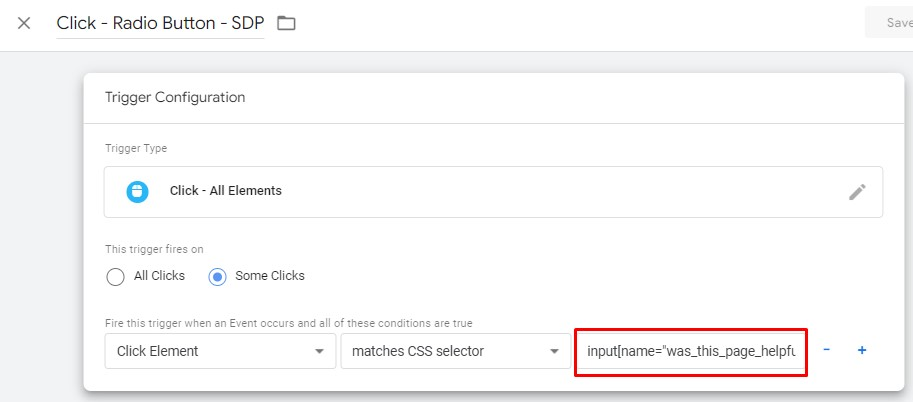

* **Const - Form - CSS - Selector - WOVG - Config**
    * This is already configured for SDP websites
    * Create a CSS selector that targets forms on the website
        * E.g. form.rpl-form
    * The targeted element must be/return the "form" tag
    * Use , (commas) to set different forms
    * This will only target the first form found per page, so please do not include site search forms.

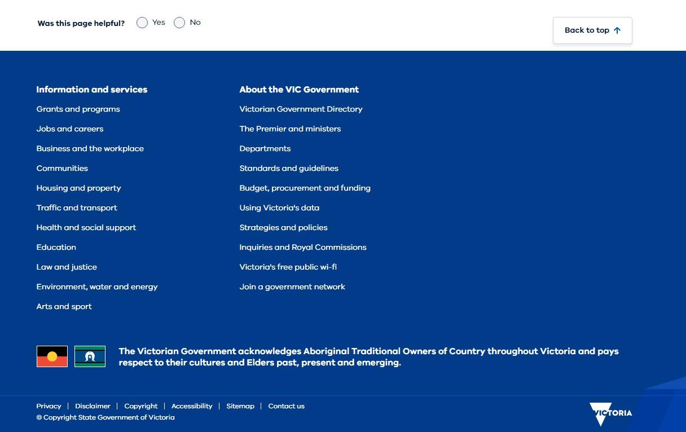

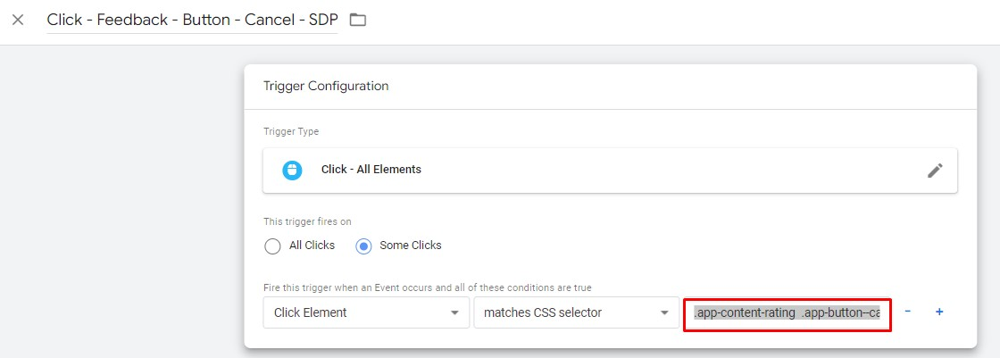

* **Const - Page Not Found - CSS - WOVG - Config**
    * This is already configured for SDP
    * Create a CSS selector that targets the "not found" text holder html element shown on the page
        * E.g. .app-error p.app-error-intro
    * You can access a 404 page by creating a fake page path on the domain e.g. /test-404

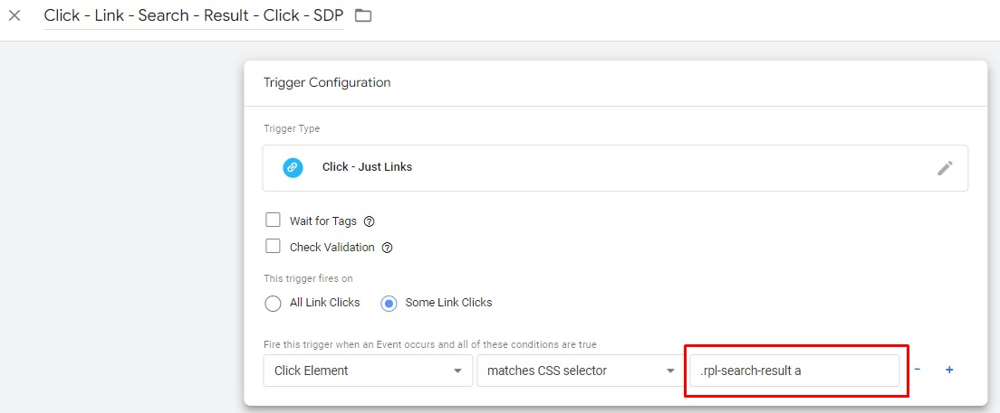

* **Const - Query - Accepted - WOVG - Config**
    * This is already configured for SDP to accept the "q" query string parameter for search.
        * E.g. /search?**q**=test
    * By default all page paths are cleared of query strings and anchors (#)
        * This provides clean page paths in Google Analytics and allows for the grouping of pages. Query strings will create unique reporting rows and it  becomes difficult to aggregate totals in page reports.
        * The full query string is captured as Custom Dimension 34 (url.query (h-34))
    * If you would like to add specific query keys to appear in page reports, please add them here.
    * You can add multiple values by using a commer "," e.g. q,page,... etc
* **DOM - Meta - Content Type - WOVG - Config**
    * This is already configured for SDP

* **DOM - Meta - Site Section - WOVG - Config**
    * This is already configured for SDP

* **Const - Body Content - CSS - WOVG - Config**
    * This is already configured for SDP
    * This will be used to calculate the word count for the page excluding navigation.
    * Please use a CSS Selector to target the HTML element on-page that holds the body content. e.g. #rpl-main-content

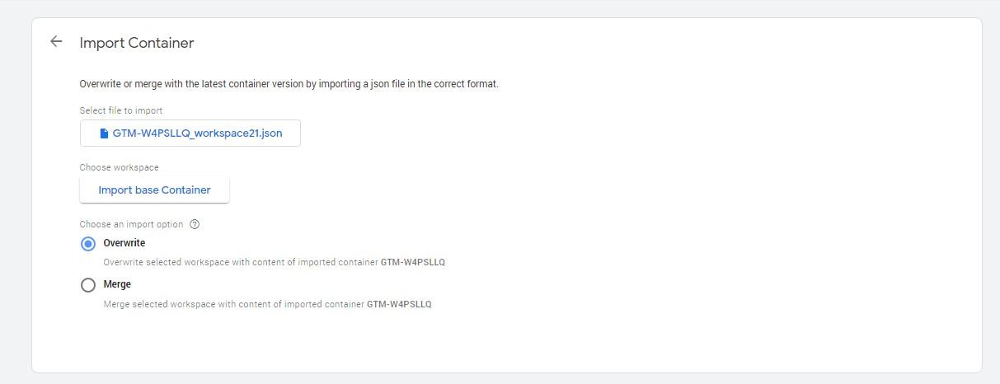

# **3 - Custom Dimensions**

The Google Tag Manager Container is preconfigured to send custom data points to Google Analytics via Custom Dimensions.

( [https://support.google.com/analytics/answer/2709829?hl=en](https://support.google.com/analytics/answer/2709829?hl=en))

Custom Dimensions & Metrics work on an index (number 1-200). These indexes are already setup in Google Tag Manager, however it is very likely the Google Analytics property will need to be configured to match.

The standard version of Google Analytics provides 20 custom dimensions and 20 metrics. The 360 (premium) version provides 200 each. In order to prevent conflict with pre-existing configurations index’s are started from 20+. Allowing the first 20 to be used by a department as required. If these are not required, you will still need to create them, simply use the name "holder" and set to inactive.

<table>
  <tr>
   <td><strong>Index</strong>
   </td>
   <td><strong>Name</strong>
   </td>
   <td><strong>Scope</strong>
   </td>
   <td><strong>State</strong>
   </td>
  </tr>
  <tr>
   <td>1-20
   </td>
   <td>holder/Existing Name
   </td>
   <td>Hit/Existing Scope
   </td>
   <td>Inactive/Existing State
   </td>
  </tr>
  <tr>
   <td>21
   </td>
   <td>content.site.section (h-21)
   </td>
   <td>Hit
   </td>
   <td>Active
   </td>
  </tr>
  <tr>
   <td>22
   </td>
   <td>content.publication.name (h-22)
   </td>
   <td>Hit
   </td>
   <td>Active
   </td>
  </tr>
  <tr>
   <td>23
   </td>
   <td>content.type (h-23)
   </td>
   <td>Hit
   </td>
   <td>Active
   </td>
  </tr>
  <tr>
   <td>24
   </td>
   <td>gtm.container.id (h-24)
   </td>
   <td>Hit
   </td>
   <td>Active
   </td>
  </tr>
  <tr>
   <td>25
   </td>
   <td>gtm.container.version (h-25)
   </td>
   <td>Hit
   </td>
   <td>Active
   </td>
  </tr>
  <tr>
   <td>26
   </td>
   <td>click.download.file.type (h-26)
   </td>
   <td>Hit
   </td>
   <td>Active
   </td>
  </tr>
  <tr>
   <td>27
   </td>
   <td>page.keyword (h-27)
   </td>
   <td>Hit
   </td>
   <td>Active
   </td>
  </tr>
  <tr>
   <td>28
   </td>
   <td>gtm.event (h-28)
   </td>
   <td>Hit
   </td>
   <td>Active
   </td>
  </tr>
  <tr>
   <td>29
   </td>
   <td>ga.client.id (u-29)
   </td>
   <td>User
   </td>
   <td>Active
   </td>
  </tr>
  <tr>
   <td>30
   </td>
   <td>session.id (s-30)
   </td>
   <td>Session
   </td>
   <td>Active
   </td>
  </tr>
  <tr>
   <td>31
   </td>
   <td>click.classes (h-31)
   </td>
   <td>Hit
   </td>
   <td>Active
   </td>
  </tr>
  <tr>
   <td>32
   </td>
   <td>timestamp (h-32)
   </td>
   <td>Hit
   </td>
   <td>Active
   </td>
  </tr>
  <tr>
   <td>33
   </td>
   <td>content.filters (h-33)
   </td>
   <td>Hit
   </td>
   <td>Active
   </td>
  </tr>
  <tr>
   <td>34
   </td>
   <td>url.query (h-34)
   </td>
   <td>Hit
   </td>
   <td>Active
   </td>
  </tr>
  <tr>
   <td>35
   </td>
   <td>event.data (h-35)
   </td>
   <td>Hit
   </td>
   <td>Active
   </td>
  </tr>
  <tr>
   <td>36
   </td>
   <td>department (h-36)
   </td>
   <td>Hit
   </td>
   <td>Active
   </td>
  </tr>
  <tr>
   <td>37
   </td>
   <td>content.wordcount.range (h-37)
   </td>
   <td>Hit
   </td>
   <td>Active
   </td>
  </tr>
  <tr>
   <td>38
   </td>
   <td>content.wordcount (h-38)
   </td>
   <td>Hit
   </td>
   <td>Active
   </td>
  </tr>
  <tr>
   <td>39
   </td>
   <td>content.read.time (h-39)
   </td>
   <td>Hit
   </td>
   <td>Active
   </td>
  </tr>
</table>

# **4 - Non SDP Configuration Support**
IMPORTANT: Non SDP websites are assumed to also be non-SPA (non single page application) for the purposes of page navigation. If you are setting up GTM tracking for a Non SDP website that is an SPA website, please get in touch at analytics.team@dpc.vic.gov.au for additional guidance, as some of the below configurations will need to be different.

The below heading names mirror the names of the tags in the GTM container for easier reference. For each of these tags, please make the updates as listed.

## **CHTML - Caretaker - message.js - WOVG**

Navigate to Tags:

* Tags
* Search > "CHTML - Caretaker - message.js - WOVG"
* Click Tag

Move Tag to Folder

* Click Folder Icon
* Select "Website - Non SDP - Support"

Update Triggering:

* Navigate to Triggering
* Click Edit Icon
* Remove "CE - routeChange - WOVG"
* Click "Choose a trigger to make…"
* Select "All Pages"

## **GA - Event - Error - Content - 404 - SDP**

Navigate to Tags:

* Tags
* Search > "GA - Event - Error - Content - 404 - SDP"
* Click Tag

Move Tag to Folder

* Click Folder Icon
* Select "Website - Non SDP - Support"

Update Triggering:

* Navigate to Triggering
* Click Edit Icon
* Remove "CE - routeChange - Page not found - WOVG"
* Click "Choose a trigger to make…"
* Select "Page - DOM Ready - Page Not Found - WOVG"

## The following section is for configuring the base container to work for the new version of Google Analytics (GA4)

** Before you begin this implementation, you will need to ensure that there is a property setup in Google Analytics. If there is no property configured, please refer to this document on Setting up a GA4 Property **

## **GA - Pageview - WOVG**

Navigate to Tags:

* Tags
* Search > "GA - Pageview - WOVG"
* Click Tag

Update Paused:

* Click "Unpause"

Navigate to Tags:

* Tags
* Search > "GA - Pageview - Route Change - WOVG"
* Click Tag

Update Paused:

* Click "Stacked Dots" (Next to Save button in the top right)
* From the menu click "Pause"

## **GA - Event - Content - Feedback - Cancel - SDP**

**_Update requires developer knowledge (HTML/CSS/JavaScript)_**

Navigate to Tags:

* Tags
* Search > "GA - Event - Content - Feedback - Cancel - SDP"
* Click Tag

Update Triggering:

* Navigate to Triggering
* Click Trigger "Click - Feedback - Button - Cancel - SDP"
* Edit "Fire this trigger…" CSS selector value input
    * You will need to use CSS selectors to target the cancel button on your feedback form.
    * [https://www.w3schools.com/CSSref/CSS_selectors.asp](https://www.w3schools.com/CSSref/CSS_selectors.asp)

Move Trigger to Folder

* Click Folder Icon
* Select "Website - Non SDP - Support"

Update Variable :

* Navigate to Variables
* Scroll down to "User-Defined Variables"
* Search for "CJS - Feedback Form - Yes/No status"
* Click "CJS - Feedback Form - Yes/No status"
* Edit "document.querySelector" to target your yes/no opinion.
    * Adjust Custom Javascript as required
    * Return value should be "yes" or "no" or "no-value"

Move Variable to Folder

* Click Folder Icon
* Select "Website - Non SDP - Support"

## **GA - Event - Content - Feedback - SDP**

**_Update requires developer knowledge (HTML/CSS/JavaScript)_**

Navigate to Tags:

* Tags
* Search > "GA - Event - Content - Feedback - SDP"
* Click Tag

Update Triggering:

* Navigate to Triggering
* Click Trigger "Click - Radio Button - SDP"
* Edit "Fire this trigger…" CSS selector value input
    * You will need to use CSS selectors to target the feedback value selection element
    * [https://www.w3schools.com/CSSref/CSS_selectors.asp](https://www.w3schools.com/CSSref/CSS_selectors.asp)

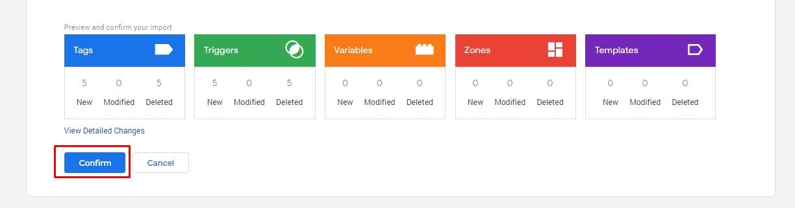

Move Trigger to Folder

* Click Folder Icon
* Select "Website - Non SDP - Support"

Update Variable :

* Navigate to Variables
* Scroll down to "User-Defined Variables"
* Search for "CJS - Form - Radio - Value - SDP"
* Click "CJS - Form - Radio - Value - SDP"
* Edit custom JavaScript to target the user feedback selection element.
* Return value should be "yes" or "no" or "no-value"

Move Variable to Folder

* Click Folder Icon
* Select "Website - Non SDP - Support"

## **GA - Event - Content - Feedback - Submit - SDP**

**_Update requires developer knowledge (HTML/CSS)_**

Navigate to Tags:

* Tags
* Search > "GA - Event - Content - Feedback - SDP"
* Click Tag

Update Triggering:

* Navigate to Triggering
* Click Trigger "Click - Feedback - Button - Submit - SDP"
* Edit "Fire this trigger…" CSS selector value input
    * You will need to use CSS selectors to target the form feedback submit button
    * [https://www.w3schools.com/CSSref/CSS_selectors.asp](https://www.w3schools.com/CSSref/CSS_selectors.asp)

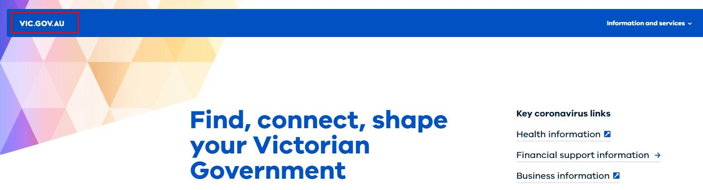

Move Trigger to Folder

* Click Folder Icon
* Select "Website - Non SDP - Support"

## **GA - Event - Form - Complete - WOVG**

**_Update requires developer knowledge (HTML/CSS)_**

Navigate to Tags:

* Tags
* Search > "GA - Event - Form - Complete - WOVG"
* Click Tag

Update Triggering:

* Navigate to Triggering
* Click Trigger "EV - Form Complete - Confirmation Message"
* Edit "Element Selector"
    * You will need to use CSS selectors to target the form success/complete message element that is displayed to the user.
    * [https://www.w3schools.com/CSSref/CSS_selectors.asp](https://www.w3schools.com/CSSref/CSS_selectors.asp)

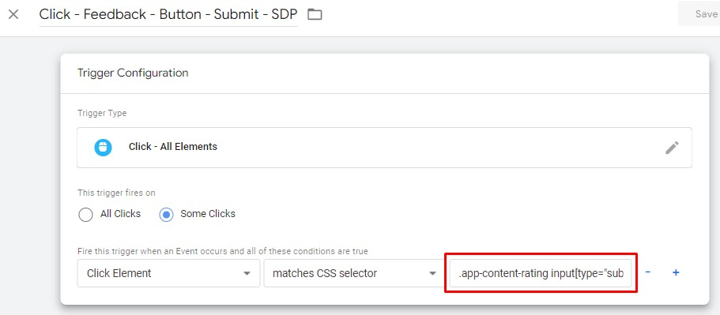

Move Trigger to Folder

* Click Folder Icon
* Select "Website - Non SDP - Support"

## **GA - Event - Navigation - SDP**

**_Update requires developer knowledge (HTML/CSS)_**

Update Variable :

* Navigate to Variables
* Scroll down to "User-Defined Variables"
* Search for "LTR - Navigation Types - SDP"
* Click "LTR - Navigation Types - SDP"
* Edit the "RegEx Table" "Patterns"
    * Do not change the output
    * Change the RegEx patterns to target the html elements that best represent the Output value for each row.

Move Variable to Folder

* Click Folder Icon
* Select "Website - Non SDP - Support"

## **GA - Event - Navigation - Search - Result - Click - SDP**

**_Update requires developer knowledge (HTML/CSS)_**

Navigate to Tags:

* Tags
* Search > "GA - Event - Navigation - Search - Result - Click - SDP"
* Click Tag

Update Triggering:

* Navigate to Triggering
* Click Trigger "Click - Link - Search - Result - Click - SDP"
* Edit "Fire this trigger…" CSS selector value input
    * You will need to use CSS selectors to target the search result click
    * [https://www.w3schools.com/CSSref/CSS_selectors.asp](https://www.w3schools.com/CSSref/CSS_selectors.asp)

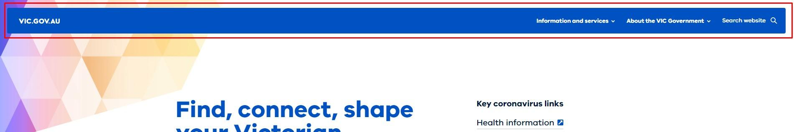

Move Trigger to Folder

* Click Folder Icon
* Select "Website - Non SDP - Support"

## **GA - Event - Social Media Share - SDP**

**_Update requires developer knowledge (HTML/CSS)_**

Navigate to Tags:

* Tags
* Search > "GA - Event - Navigation - Search - Result - Click - SDP"
* Click Tag

Update Triggering:

* Navigate to Triggering
* Click Trigger "Click - Social Media - SDP"
* Edit "Fire this trigger…" CSS selector value input
    * You will need to use CSS selectors to target the social share links
    * [https://www.w3schools.com/CSSref/CSS_selectors.asp](https://www.w3schools.com/CSSref/CSS_selectors.asp)

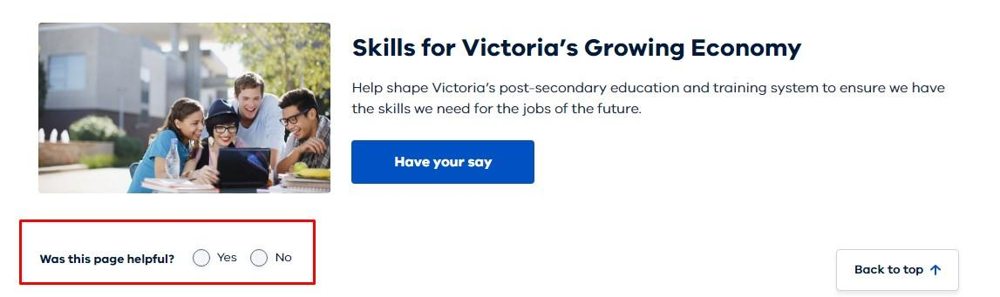

Move Trigger to Folder

* Click Folder Icon
* Select "Website - Non SDP - Support"

Update Variable :

* Navigate to Variables
* Scroll down to "User-Defined Variables"
* Search for "CJS - Social - Media - Source - SDP"
* Click "CJS - Social - Media - Source - SDP"
* Edit custom JavaScript to target the social share links
    * The current setup uses the clicked text, however you can adjust the code to what is required for social shares.
* Return values are:
    * Twitter, Facebook, LinkedIn
    * "no-value"

Move Variable to Folder
* Click Folder Icon
* Select "Website - Non SDP - Support"

## **GA4 - Configuration**

Navigate to Tags:

* Tags
* Search > "GA4 - Configuration"
* Click Tag

Move Tag to Folder

* Click Folder Icon
* Select "Website - Non SDP - Support"

Update Triggering:
* Navigate to Triggering
* Click Edit Icon
* Remove "CE - custom.routeChange.update - WOVG"
* Click "Choose a trigger to make…"
* Select "All Pages"

## **GA4 - Event - Content - Error - Page not found - SDP**

Navigate to Tags:

* Tags
* Search > "GA4 - Event - Content - Error - Page not found - SDP"
* Click Tag

Move Tag to Folder
* Click Folder Icon
* Select "Website - Non SDP - Support"
Update Triggering:
* Navigate to Triggering
* Click Edit Icon
* Remove "CE - routeChange - Page not found - WOVG"
* Click "Choose a trigger to make…"
* Select "Page - DOM Ready - Page Not Found - WOVG"

# **5 - GA4 setup**
Before you begin this implementation, you will need to ensure that there is a GA4 property set up in Google Analytics. If there is no property configured, or to ensure your existing property is set up to work with this GTM container, please refer to the [WoVG - GA4 Property Configuration - Base Container Version March 2022 document.](https://drive.google.com/file/d/1BQddlDjEGA1CBoUZnXIDNeSd354ExqNW/view?usp=sharing)
